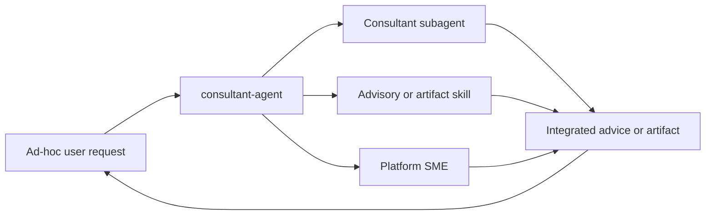

# Consultant Agent

The `consultant-agent` is an off-workflow dispatcher for one-off advice and
requested artifacts. It selects the most specific consultant, skill, or
platform SME, then integrates the result for the user.

## Position

It is not part of the ordered SDLC workflow, is not a required gate, and does
not produce workflow handoffs.

## Inputs

- A one-off question or requested artifact.
- Relevant context supplied by the user.
- Platform, output-format, and audience constraints when applicable.

## Dispatch method

1. Classify the request across consultant subagents, loadable skills, and
   platform SMEs.
2. Choose the most specific fit; do not force a specialist when none fits.
3. Route the question and context, then integrate the response.
4. State which consultant was used.

Consultants remain directly invokable; this agent is a convenience layer, not
a mandatory front door.

### Capacity-management consultant

`capacity-manager` reconciles professional-services delivery-team design,
internal bench/capacity matching, recruiting gaps, and productive-capacity
timelines. It loads `delivery-capacity-planner` and
`recruiting-capacity-planner`, preserves mandatory staffing constraints, and
reports requested, delivery-optimized, recruiting-feasible, and balanced
scenarios when those distinctions affect the decision.

Its outputs are recommendations, not employee assignments, requisitions,
budgets, or client commitments. Missing internal data remains an explicit
assumption, and confidential employee/candidate information stays protected.

### Commercial delivery consultant

`delivery-manager` integrates professional-services engagement pricing, revenue
operations, and contract lifecycle governance. It loads `pricing-strategy`,
`proposal-and-sow-writer`, and—only for explicit legal drafting or comparison
requests—`contract-drafting-assistant`.

It compares engagement models; tracks pipeline, bookings, backlog, forecast,
realization, margin, leakage, invoice readiness, and renewals; and maintains the
commercial relationship among proposals, SOWs, NDAs, MSAs, DPAs, amendments,
change requests, acceptance evidence, and invoicing triggers. It does not run
project execution, allocate staff, establish accounting policy, or give legal
advice.

All outputs are non-binding. Outcome-linked scenarios require measurable
baselines, attribution rules, capped upside and downside, floors, exclusions,
reconciliation, limited audit rights, worked examples, and human finance/legal
approval before contractual use.

### Technical pre-sales consultant

`sales-engineer` owns opportunity-specific technical discovery, RFP/RFI
coverage, buyer-specific demos, bounded POCs, competitive technical evidence,
objection handling, and post-decision handoffs. It loads
`presales-engineering` for reusable analysis, templates, and deterministic
helpers.

Material architecture decisions route to `architect-agent`; pricing,
engagement models, proposals/SOWs, and contract coordination route to
`delivery-manager`. Product, security, compliance, delivery, commercial, and
legal owners retain approval of claims and commitments. The consultant never
submits an RFP, contacts a prospect, provisions a POC, or promises roadmap work
without separate authorization.

### Marketing communications consultant

`marketing-manager` handles company-agnostic press releases plus thought
leadership, opinion pieces, technical articles, corporate publications, and
LinkedIn content. It loads `press-release` for formal company news and
`thought-leadership-writing` for expert arguments and educational publications;
it loads both only when both artifacts are requested. The supplied Globant
press-release examples define tone only and never supply default company facts.

For thought leadership, the consultant preserves the author's actual viewpoint,
experience, and evidence. It does not invent opinions, credentials, results,
customer stories, or organizational positions. It returns a publication-ready
draft and review checklist, not authorization to publish.

The consultant does not publish or distribute releases. Wire submission,
journalist outreach, social posting, website changes, and material legal,
securities, investor-relations, financial, employment, partner, trademark,
privacy, or regulatory claims retain their normal authorization and review.

### Industry SME consultant

`industry-sme` handles questions whose product, operating model, or risk depends
materially on climate tech, ecommerce, education, fintech, healthtech,
marketplaces, or proptech. It chooses one primary vertical and adds a secondary
vertical only when that changes requirements or risk, then loads only the
corresponding `*-advisor` skills.

Its response integrates customer, product, technical, commercial, operating,
data, and regulatory context. Time-sensitive and high-stakes claims require
current authoritative evidence. Legal, regulatory, clinical, licensing,
certification, compliance, investment, and carbon-impact conclusions remain
advisory hypotheses for qualified human review. It is directly invokable and
is not a core SDLC workflow stage.

### Mergers and integrations consultant

`mergers-and-integrations` coordinates detailed buyer and seller strategy,
target screening, diligence, valuation and deal-structure scenarios,
negotiation and closing readiness, post-merger integration, and synergy
governance. It loads the shared `ma-playbook` and adds functional specialists
only when their evidence is material.

The consultant distinguishes verified evidence, management-provided facts,
assumptions, inferences, open items, and matters requiring professional review.
It may coordinate executive, architecture, security, industry, people,
commercial, and delivery perspectives, but none independently clears a deal.
Legal, tax, accounting, securities, antitrust, employment, privacy, regulatory,
investment, fairness, solvency, and valuation conclusions remain with qualified
professionals and actual approval bodies.

Its artifacts are non-binding. It never accesses a data room, contacts parties,
submits or accepts terms, signs or closes, moves funds, changes access,
communicates with employees or customers, terminates roles, migrates systems,
or executes integration work without separate explicit authorization.

### Founder leadership coaching

`founder-leadership-coaching` is a loadable consultant skill for founders and
first-time executives working through role transitions, delegation,
decision bottlenecks, calendar and attention allocation, co-founder dynamics,
executive-team behavior, feedback, and succession resilience.

Use `executive-advisor` when enterprise strategy or an executive decision is
primary; it may load the coaching skill when the issue is the founder's own
leadership system. Use `sounding-board-agent` for challenge of a specific idea.
Coaching outputs are non-clinical reflections and experiments, never mental-
health, employment, governance, succession, board, or fitness-for-duty decisions.

### Executive decision council

When a user asks to convene a simulated board, executive council, or structured
cross-functional deliberation, `executive-advisor` uses its
`executive-decision-council` mode. It selects two to four materially different
perspectives, develops them independently from shared evidence, runs a critic
pass, surfaces genuine disagreements, and synthesizes options before stopping
for the actual human decision owner.

This is a decision-support method, not a formal board meeting. Model-generated
roles are not directors, cannot establish quorum or vote, and cannot create
formal approval, minutes, resolutions, or governance records. Those artifacts
require the organization's board process and qualified legal or corporate-
secretary review.

### Team catch-up consultant

`explain-new-contributions` supports developers starting a shift or returning
to a shared codebase. It receives the current repository plus an optional
last-known commit/date and area of interest. It performs read-only Git analysis:

- On a non-`main` branch, it separates work newly present on main since branch
  divergence, commits unique to the working branch, and staged/unstaged or
  untracked working-tree changes.
- On `main`, it analyzes only main from the supplied baseline or a clearly
  labeled last-24-hours default.
- It prefers the available `origin/main` tracking ref, reports its freshness,
  and never fetches or changes branches without permission.

Its briefing explains features, architecture patterns and decisions,
development principles and guidelines, operational or migration effects,
risks, and recommended developer follow-ups. Material claims cite commits and
files; inferred rationale is explicitly labeled rather than presented as a
documented team decision. Sensitive files are excluded.

### Sounding-board consultant

`sounding-board-agent` is a critical but constructive partner for evaluating
ideas, plans, product directions, architecture choices, and solution approaches.
It consumes the idea, desired outcome, constraints, and available project
context. It investigates repository-answerable questions before asking the
user, then resolves the remaining decision tree one question at a time.

For project-grounded discussions it uses `grill-with-docs` to challenge domain
language, code, context documents, and ADRs. For general discussions it may use
`grill-me`. It adds architecture, estimation, security, data, cloud, UX, or
accessibility skills only when a concrete decision requires that lens.

The agent steelmans the proposal before challenging assumptions, evidence,
failure scenarios, hidden costs, and second-order effects. It compares at least
two materially different alternatives—including doing nothing or running a
smaller experiment when legitimate—and concludes `SOLID`, `PROMISING BUT
REVISE`, `WEAK`, or `INSUFFICIENT EVIDENCE`. It agrees only when the problem,
evidence, feasibility, risks, alternatives, project alignment, and remaining
risk support agreement. Criticism includes consequences and an improved path.

The agent may propose `CONTEXT.md` or ADR updates as decisions crystallize. It
edits them only after explicit authorization of the documentation scope and the
repository plan gate; consultation alone never creates binding project policy.

## Outputs

Outputs are advice or user-requested artifacts such as team catch-up briefings,
research, humanized text, cloud estimates, documentation, spreadsheets, or presentations. They go
to the user-designated or scratch/output location, never automatically into
workflow specs, architecture, backlog, or other handoff folders.

Business-value and ROI consultations load the shared `enterprise-value-engineer`
skill. SaaS value-metric, packaging, price-research, and price-change work loads
the shared `pricing-strategy` skill. Pitch creation and substantial deck restructuring load the shared
`pitch-deck-builder` skill. AI Pod capacity and VTU subscription proposals load
the shared `vtu-estimator` skill. Financial models, board reporting, planning,
and formula-driven operational workbooks load `financial-workbook-builder`;
simple spreadsheet edits use general spreadsheet tooling. None is a subagent or
SDLC workflow stage.

## Interactions and boundaries

The agent may dispatch active consultants and SMEs or activate dormant platform
SMEs only when their platform is in scope. It advises rather than builds and
does not make binding workflow decisions. SDLC agents may consult SMEs for
evidence without inserting this agent as a workflow stage.

## Vault behavior

Because it is off-workflow, consultant output is not automatically promoted to
canonical SDLC knowledge. When the vault is enabled, a material outcome may be
recorded only when it is relevant and supported, using semantic notes and the
action log without inventing a workflow handoff.

## Completion

The consultation is complete when the best-fit source has answered the request,
the result is integrated and attributed, and no unsupported workflow decision
has been created.

<!-- agent-auditor:inventory:start -->

## Audited agent inventory

- Source: [`consultant-agent`](../../../agents/consultant-agent/consultant-agent.md)
- Subagents:
  - `ai-advisor` — Expert advisor on leveraging AI to optimize software development processes and business operations. Two modes: (1) Software Dev — deep technical guidance on AI coding tools, LLM APIs, agent frameworks, DevOps AI, RAG, vector DBs, and inference infra, with production-proven stack recommendations and…
  - `aws-sme` — AWS Subject Matter Expert operating at Solutions Architect Professional level. Covers the full AWS service catalog: compute (EC2, Lambda, ECS Fargate, EKS, Auto Scaling), networking (VPC, Transit Gateway, Direct Connect, PrivateLink, Route 53), storage (S3, EFS, FSx), databases (Aurora, DynamoDB, El…
  - `azure-sme` — Azure Subject Matter Expert operating at senior cloud architect level. Covers the full Azure service catalog: compute (VMs, AKS, App Service, Functions, Container Apps), networking (VNet, NSG, Azure Firewall, Load Balancer, Application Gateway, ExpressRoute), storage and databases (Blob, Azure SQL,…
  - `capacity-manager` — Active consultant subagent for professional-services capacity planning, delivery-team design, bench matching, recruiting plans, staffing timelines, and workforce recommendations. Use for project staffing demand, capacity feasibility, team composition, geo/seniority validation, bench allocation, or r…
  - `cloud-consumption-estimation` — Estimates cloud resource consumption (and cost) from volumetric data - requests, users, storage, egress, compute hours, message/stream volume - mapping each driver to billable units and, when a price is wanted, to a region-specific cost. When volumetric data is missing, it does NOT silently invent:…
  - `delivery-manager` — Off-workflow commercial delivery consultant for professional-services engagements. Integrates engagement pricing, revenue operations, SOW and contract lifecycle coordination, commercial performance, and renewal readiness. Produces non-binding scenarios and governance artifacts; never manages project…
  - `explain-me` — Read-only senior-engineer consultant that analyzes codebases, features, bug fixes, architectures, and technologies; explains how and why they work; compares alternatives; recommends an approach; and always delivers both written and safe spoken explanations. Invokable directly or through consultant-a…
  - `explain-new-contributions` — Read-only team catch-up consultant for developers starting a shift or returning to a shared codebase. Explains changes on the current working branch and changes contributed to main in terms of features, architecture, decisions, principles, guidelines, risks, and follow-up actions. When the current b…
  - `gcp-sme` — Google Cloud Platform Subject Matter Expert operating at Professional Cloud Architect level. Covers the full GCP service catalog: compute (GCE, GKE, Cloud Run, Cloud Functions), networking (VPC, Load Balancing, Interconnect), storage and databases (GCS, Cloud SQL, Spanner, Firestore, Bigtable), big…
  - `humanizer` — Converts LLM-generated text into text that reads as human-written, changing style, structure, and content as LITTLE as possible. A thin consultant subagent over the `humanizer` skill - it removes the tells of AI writing (inflated significance, promotional tone, -ing padding, em-dash overuse, rule-of…
  - `industry-sme` — Off-workflow industry router and synthesis consultant. Identifies the primary and materially relevant secondary verticals, loads only the applicable vertical-advisor skills, reconciles cross-industry constraints, and produces evidence-led orientation with explicit expert-review boundaries. Invokable…
  - `marketing-manager` — Off-workflow marketing communications consultant for factual press releases and evidence-led thought leadership, technical articles, corporate publications, and LinkedIn content. Routes to the applicable shared writing skill and produces review-ready drafts; never publishes or distributes them witho…
  - `mergers-and-integrations` — Off-workflow M&A consultant for buyer and seller strategy, screening, diligence coordination, valuation and structure scenarios, negotiation preparation, closing readiness, post-merger integration, and synergy tracking. Produces non-binding, review-required analysis and never executes a transaction…
  - `pre-mortem-agent` — Prospective-hindsight consultant that assumes a proposed product, idea, launch, or project failed 14 days after launch, then works backward to identify evidence-backed Tigers, unlikely Paper Tigers, and unspoken Elephants. Produces actionable mitigations and can advise product-agent
  - `sales-engineer` — Off-workflow technical pre-sales consultant that owns discovery synthesis, RFP/RFI technical responses, solution options, tailored demos, bounded POCs, competitive evidence, technical objections, and post-decision handoffs. Uses presales-engineering and coordinates architecture and commercial specia…
  - `snowflake-sme` — Snowflake Subject Matter Expert for data platform architecture, implementation, optimization, governance, cost control, and operational excellence. Use when designing, troubleshooting, tuning, securing, or estimating Snowflake-based solutions across AWS, Azure, and Google Cloud. Covers architecture,…
  - `software-tutor` — Software engineering tutor that explains concepts at two levels: simple (ELI5) and technical (junior-engineer depth). Covers code, architecture, debugging, APIs, databases, cloud, testing, and system design. Always explains *why* teams use a tool, what problem it solves, compares competing products,…
  - `sounding-board-agent` — Critical but constructive consulting partner that stress-tests ideas, plans, product directions, architecture choices, and solution approaches. Uses grill-with-docs for project-grounded discussion, investigates repository-answerable questions, exposes assumptions and counterarguments, proposes mater…
  - `web-search` — Use this agent when you need to research information on the internet, particularly for debugging issues, finding solutions to technical problems, or gathering comprehensive information from multiple sources. This agent excels at finding relevant discussions. Use when you need creative search strateg…

<!-- agent-auditor:inventory:end -->
