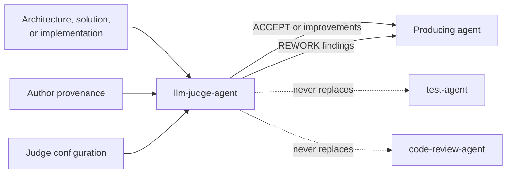

# LLM Judge Agent

The `llm-judge-agent` provides an optional independent quality assessment of
architecture, solutioning, or implementation. Its defining requirement is that
the judge model differs from the author model.

## Workflow position

## Inputs

- One artifact or implementation diff per judgment.
- Its binding specs, PRD, guidelines, criteria, backlog item, and ADRs as
  applicable.
- Author model provenance from artifact metadata or commit trailers.
- Judge provider/command settings from `ADLC_workflow_settings.json`.
- The artifact-specific rubric.

## Cross-model rule

The agent establishes author identity from recorded provenance and selects a
different provider where possible, otherwise at least a different model. It
never silently self-judges. If no alternative is reachable, it stops for an
operator decision or clearly banners a same-model report as reduced confidence.

## Outputs

The report is written to
`docs/reviews/judge-<phase>-<slug>-<YYYY-MM-DD>.md` and includes:

- Verdict first: ACCEPT, ACCEPT-WITH-IMPROVEMENTS, or REWORK.
- Judge/author model disclosure and provenance source.
- Rubric scores with evidence-based justifications.
- Cited findings and ranked improvements with impact and effort.
- Must-fix versus should-consider separation.

## Interactions and boundaries

The producing agent receives the verdict and decides how to respond; REWORK
returns to architect or developer as appropriate. The judge is advisory: it
does not edit artifacts, write code, transition backlog items, or replace
testing and review. It runs on demand unless project settings make architecture
or development invoke it automatically.

## Vault behavior

Judge reports are mirrored into `Reviews/` when enabled and linked to judged
artifacts. Material findings and trade-offs are recorded in semantic notes
without altering the artifact being judged.

## Completion

A judgment completes when model separation is disclosed, citations are
validated against real content, the rubric is fully scored, improvements are
prioritized, and the report is routed back to the producing agent.

<!-- agent-auditor:inventory:start -->

## Audited agent inventory

- Source: [`llm-judge-agent`](../../../agents/llm-judge-agent/llm-judge-agent.md)
- Subagents: none

<!-- agent-auditor:inventory:end -->
