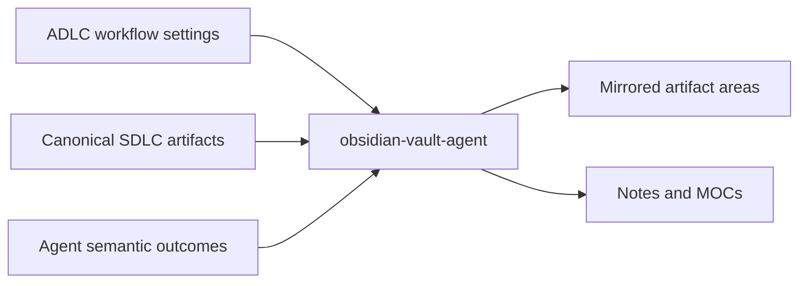

# Obsidian Vault Agent

The `obsidian-vault-agent` is an optional, off-workflow knowledge recorder. It
mirrors canonical SDLC artifacts and records semantic outcomes as a navigable
Obsidian graph without becoming a workflow gate.

## Position

## Activation and inputs

The agent reads `obsidian_vault` from `ADLC_workflow_settings.json`:

- `enabled`: disabled or missing means no action.
- `vault_path`: required and writable when enabled; the agent never guesses it.
- `link_mode`: `symlink` by default or `copy` for portable vaults.

Inputs are canonical PRDs, specs, architecture, ADRs, backlog, estimation, UX,
reviews, test cases, and explicit semantic outcome records from agents.

## Outputs

- Mirrored canonical artifacts in their vault areas.
- Authored decision, plan, implementation, issue, and lesson notes in `Notes/`.
- `00-index.md` and feature Maps of Content.
- Bidirectional wikilinks connecting the delivery graph.

Canonical files remain the source of truth. In symlink mode they are linked,
not duplicated or hand-edited through the vault.

## Vault behavior

The deterministic writer is `scripts/helper-scripts/vault-event.py`. For example, an approved
developer plan is recorded with `--kind plan` and `--details-file`, creating an
exact Markdown note before implementation. Other agents record material
decisions, approaches, issues, trade-offs, conclusions, and implementation
notes with related canonical artifacts.

## Interactions and boundaries

This is the only agent allowed to write inside the configured vault and it
writes nowhere else. It does not create product knowledge, modify canonical
project files, decide delivery gates, or block handoffs. Synchronization is
idempotent, non-destructive, and never deletes a user's notes.

One exception belongs to the developer workflow rather than this agent: when
the vault is enabled, failure to persist an explicitly approved implementation
plan blocks development until reported and resolved.

## Completion

A recording pass completes when applicable artifacts are mirrored, links and
indexes are current, and semantic notes capture material outcomes without
secrets.

<!-- agent-auditor:inventory:start -->

## Audited agent inventory

- Source: [`obsidian-vault-agent`](../../../agents/obsidian-vault-agent/obsidian-vault-agent.md)
- Subagents: none

<!-- agent-auditor:inventory:end -->
