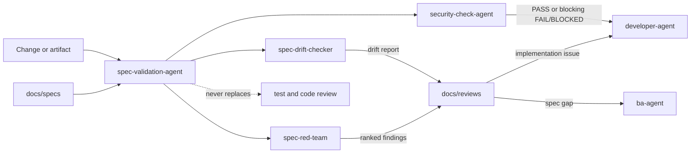

# Spec Validation Agent

The `spec-validation-agent` coordinates two advisory specification lenses and
a blocking security-assurance subagent used before agent-managed commits and
pull requests.

## Workflow position

## Inputs

- One change, diff, or artifact per run.
- Governing specifications under `docs/specs/`.
- For red-team: security classification and a confirmed non-production,
  ephemeral target containing synthetic data.
- Trigger settings from `ADLC_workflow_settings.json`.
- For security checks: the exact staged diff before a commit or complete branch
  diff before a PR, plus applicable security requirements and test evidence.

## Validation modes

- `spec-drift-checker` is active and performs read-only semantic conformance
  checks on spec-covered behavior.
- `spec-red-team` is dormant until security-sensitive scope or a requested
  pre-release pass activates it. It probes logic and contract violations that
  deterministic scanners and ordinary review may miss.
- `security-check-agent` is active and blocking when
  `security_check.pre_commit` or `security_check.pre_pr` is enabled. It checks
  secrets and credential files, `.env.example` safety, real auth/OAuth and
  authorization enforcement, logging, standard cryptography/private-key
  handling, injection and dependency risks, and negative security-test quality.

The two spec-validation modes are advisory. Security-check PASS is required at
its configured commit or PR gate; missing or invalid flags fail safe to enabled.

## Outputs

Reports are written under `docs/reviews/` with cited drift verdicts or ranked
adversarial findings. High-confidence implementation findings return to
`developer-agent`; specification gaps return to `ba-agent`. Lower-confidence
issues are marked for human review rather than silently blocking delivery.
Security-check FAIL/BLOCKED stops its repository-finalization step and returns
actionable evidence through the developer's approved-fix and defect-tracking
loop.

Confirmed red-team findings may produce regression tests. Only tests merged by
a human become part of the deterministic blocking floor.

## Interactions and boundaries

The agent is read-only toward application code and specifications. Its spec
lenses are advisory; its security checker is blocking at configured gates but
never replaces acceptance testing, code review, SAST, dependency scanning, or
DAST.

Any developer correction returned from validation follows the mandatory plan,
explicit approval, vault-recording, implementation, and test cycle.

## Vault behavior

Validation reports are mirrored into `Reviews/` when enabled and linked to the
change and governing specs. Findings, spec gaps, security problems, and triage
decisions are recorded as semantic notes and action-log entries.

## Completion

A validation run completes when evidence is cited, confidence is stated, the
report is stored, and findings are routed with the correct advisory or blocking
verdict semantics.

<!-- agent-auditor:inventory:start -->

## Audited agent inventory

- Source: [`spec-validation-agent`](../../../agents/spec-validation-agent/spec-validation-agent.md)
- Subagents:
  - `security-check-agent` — Blocking security assurance subagent of spec-validation-agent. Reviews the staged diff before agent-managed commits and the complete branch diff before agent-managed pull requests. Detects secrets, unsafe credential files, hollow auth/security controls, unsafe logging, weak cryptography, injection r…
  - `spec-drift-checker` — Semantic spec-conformance checker (conformance gate). Dispatch after implementing or modifying behavior covered by a spec in docs/specs/, before opening a PR. Compares the current diff and relevant code against the prose spec and reports drift with cited discrepancies. Detector and reporter ONLY - n…
  - `spec-red-team` — Spec-aware adversarial tester (security gate, agent ceiling). Dispatch on demand or on a schedule to attack an EPHEMERAL, synthetic-data test environment with business-logic and security-control attacks derived from the spec and the solution

<!-- agent-auditor:inventory:end -->
