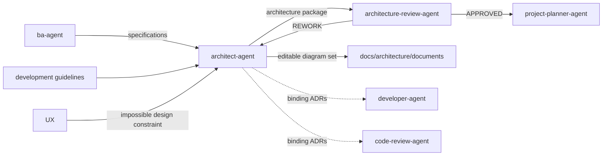

# Architect Agent

The `architect-agent` owns the **how** at design time. It converts
specifications into structural decisions, a living solution architecture, and
a dependency-aware technical decomposition.

## Workflow position

## Inputs

| Input | Source | Use |
|---|---|---|
| Feature specifications | `ba-agent` | Define required behavior and constraints. |
| `docs/architecture/development_guidelines.md` | Project governance | Supplies binding architectural guardrails when present. |
| Domain-specialist analysis | Architecture subagents and SMEs | Contributes platform constraints and ADR-ready options. |
| UX constraint feedback | `ux-agent` | Identifies architectural choices that prevent a required experience. |

If a specification conflicts with a development guideline, the architect
surfaces the conflict rather than silently choosing one.

## Outputs

- Living solution architecture at `docs/architecture/architecture.md`.
- An applicable, maintainable diagram set under
  `docs/architecture/documents/`, linked from `architecture.md`.
- One ADR per expensive-to-reverse decision under
  `docs/architecture/adrs/NNNN-<title>.md`, plus the ADR index.
- Explicit non-functional decisions covering scale, latency, cost, security,
  and observability as applicable.
- Technical tasks and dependency edges for `architecture-review-agent`, then `project-planner-agent` after approval.
- Binding constraints for `developer-agent` and `code-review-agent`.

Architecture artifacts include `generated_by: <provider>/<model>` provenance.
Configured architecture judge checks include `architecture.md`, the diagram
set, and ADRs before handoff; REWORK findings are addressed first.

Applicable diagrams cover system context, container/component structure, key
runtime or data flows, and deployment topology. Editable Mermaid `.mmd` is
preferred; PlantUML `.puml`, D2 `.d2`, Graphviz `.dot`, or another justified
text-based source is allowed. Optional SVG, PNG, or PDF renders never replace
the editable source. Files use descriptive kebab-case names.

## Ownership boundaries

The architect decides system structure and declares dependencies; it does not
sequence the backlog, design detailed user interactions, or implement code.
Architecture subagents advise within their domains, but the parent architect
owns final ADRs, cross-domain seams, and the integrated architecture.
It also owns keeping diagrams synchronized when an ADR or architecture change
alters a boundary, dependency, flow, or deployment topology.

## Agent interactions

- Consumes requirements from `ba-agent`.
- Sends the complete package to `architecture-review-agent`; resolves `REWORK`
  findings before an `APPROVED` handoff reaches planning.
- Provides binding constraints to development and review.
- Receives UX escalation when a required experience is impossible under an
  ADR, then resolves or documents the conflict.

## Vault behavior

When enabled, architecture and ADRs are mirrored into `Architecture/` and
`ADRs/` and linked to specifications, backlog items, reviews, and implementation
notes. Architectural decisions, alternatives, trade-offs, and judge outcomes
are recorded as semantic notes.

## Completion and handoff

Architecture is ready when the living document and ADRs describe the selected
design and consequences, every applicable diagram is linked and current,
relevant NFRs are addressed, technical tasks have explicit dependencies,
provenance is present, configured judge findings are resolved, and
`architecture-review-agent` has approved the exact package for planning.

<!-- agent-auditor:inventory:start -->

## Audited agent inventory

- Source: [`architect-agent`](../../../agents/architect-agent/architect-agent.md)
- Subagents:
  - `blockchain-architect` — Blockchain design subagent of architect-agent. Owns Web3 design decisions - chain/platform selection, on-chain vs off-chain split, contract architecture, key and wallet management strategy. Produces design input, never implementation. Dormant until Web3 scope appears.
  - `data-architect` — Data design subagent of architect-agent. Owns data-domain design decisions - storage selection (lake/warehouse/lakehouse), ETL vs ELT, streaming design, data flow and ownership boundaries. Produces design input, never implementation. Active by default (GCP/BigQuery core stack).
  - `databricks-architect` — Databricks design subagent of architect-agent. Owns lakehouse design decisions on Databricks - Delta Lake modeling approach, workspace/catalog topology, compute strategy, medallion layering. Produces design input, never implementation. Dormant until Databricks enters scope.
  - `embedded-architect` — Embedded design subagent of architect-agent. Owns firmware-level design decisions - RTOS/bare-metal selection, hardware constraint mapping, memory/power budgets, OTA update strategy, firmware-cloud interface contracts. Produces design input, never implementation. Dormant until firmware enters scope.
  - `iot-architect` — IoT design subagent of architect-agent. Owns device-to-cloud design decisions - protocol selection (MQTT/CoAP/LoRaWAN/BLE), device-cloud topology, fleet provisioning and OTA strategy, telemetry landing design. Produces design input, never implementation. Dormant until an IoT product enters scope.
  - `mobile-architect` — Mobile design subagent of architect-agent. Owns mobile-client design decisions - native vs cross-platform, offline/sync strategy, mobile API contracts, push/notification architecture. Produces design input, never implementation. Dormant until a mobile client enters scope.

<!-- agent-auditor:inventory:end -->
