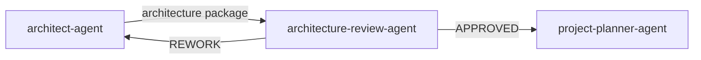

# Architecture Review Agent

`architecture-review-agent` is the independent architecture gate between
`architect-agent` and `project-planner-agent`.

## Workflow position

## Inputs

- The exact architecture document, ADR set, editable diagrams, and technical decomposition.
- The approved PRD and BA specification package, including reconciled UX output when applicable.
- Binding repository engineering and security guidance.

## Outputs

An evidence-based `APPROVED` or `REWORK` record tied to exact artifact versions.
Planning is blocked until the current package is approved.

## Ownership boundaries

The reviewer owns the verdict; `architect-agent` owns architecture content and
corrections. This review does not replace optional cross-model advice.

## Completion and handoff

Approval hands the reviewed technical decomposition to `project-planner-agent`.
A material architecture change invalidates the verdict.

<!-- agent-auditor:inventory:start -->

## Audited agent inventory

- Source: [`architecture-review-agent`](../../../agents/architecture-review-agent/architecture-review-agent.md)
- Subagents: none

<!-- agent-auditor:inventory:end -->
