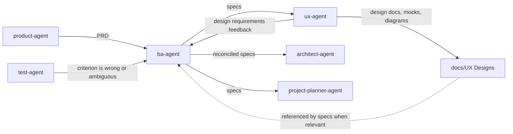

# BA Agent

The `ba-agent` owns the **what**. It translates the product vision into
functional specifications and acceptance criteria that downstream agents can
design, plan, implement, and verify without guessing.

## Workflow position

## Inputs

The primary input is `docs/project_description/PRD.md`, supported by other
material under `docs/project_description/`. If no PRD exists, the BA requests
one or routes the work through `product-agent` before creating specifications.

During requirements analysis, stakeholder answers and meeting evidence may
resolve behavioral details. Unresolved questions remain explicit open
questions; they are never filled with assumptions.

## Outputs

| Output | Consumer | Purpose |
|---|---|---|
| Feature specification in `docs/specs/<feature-name>.md` | `architect-agent` and `project-planner-agent` | Defines actors, triggers, flows, validation, state/data changes, permissions, edge cases, and embedded acceptance criteria. References files in `docs/UX Designs/` when relevant. |
| Open Questions section | Product owners and stakeholders | Makes unresolved requirements visible and blocks invention. |

Acceptance criteria are embedded in the feature specification or user story, not
produced as a separate artifact. They use Given/When/Then when appropriate and
must be specific enough to map to tests.

## Ownership boundaries

The BA writes requirements, not code, architecture, estimates, or task
breakdowns. It does not reinterpret the product strategy or silently overwrite
an existing specification. Product ambiguity returns to `product-agent`;
technical decisions go to `architect-agent`; sequencing and estimates belong to
`project-planner-agent`.

## Agent interactions

- Receives the product vision from `product-agent`.
- Sends specs to `ux-agent` for user-facing scope; receives design requirements
  feedback from `ux-agent` and reconciles it into the specs before architecture.
  Specs reference files in `docs/UX Designs/` when relevant.
- Sends reconciled specs to `architect-agent` for structural design.
- Sends specs to `project-planner-agent` for traceable backlog construction.
- Provides the original acceptance criteria (embedded in specs) against which
  `test-agent` verifies the built behavior.
- Resolves or escalates criteria that testing identifies as incorrect or
  ambiguous; tests are not weakened to conceal a requirements problem.

## Vault behavior

When enabled, the vault mirrors canonical specifications into `Specs/` and
links them to the PRD, ADRs, backlog items, reviews, and tests. Material
requirements decisions, open issues, and specification conclusions are
recorded as semantic vault events.

## Completion and handoff

A BA handoff is complete when each feature has a structured specification,
testable acceptance criteria, explicit edge cases and permissions, and no
hidden ambiguity. Anything unresolved is visible in Open Questions rather than
being passed downstream as an assumption.

<!-- agent-auditor:inventory:start -->

## Audited agent inventory

- Source: [`ba-agent`](../../../agents/ba-agent/ba-agent.md)
- Subagents: none

<!-- agent-auditor:inventory:end -->
