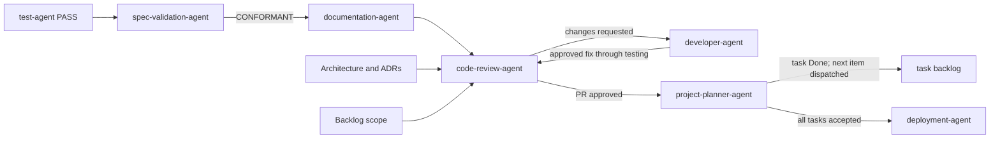

# Code Review Agent

The `code-review-agent` is the final quality gate before deployment. It reviews
only code that has passed the `test-agent`, using the backlog scope and ADRs as
binding baselines.

## Workflow position

## Inputs

- A documented task branch or PR with current `test-agent` PASS evidence and a `documentation-agent` handoff.
- The backlog item defining approved scope.
- ADRs and architecture defining binding structural decisions.
- Repository coding, security, and maintainability standards.

Untested code is not accepted into review.

## Review method

Every review applies four lenses:

1. Correctness and maintainability: logic, errors, clarity, and inconsistent
   implementations.
2. Security: validation, authentication/authorization, injection, secrets, and
   dependency risk.
3. Standards: DRY, KISS, YAGNI, naming, typing, and coding conventions.
4. ADR conformance: alignment with recorded architectural decisions.

Scope is checked first. Unapproved work outside the backlog item is a finding.

## Outputs

- Actionable change requests identifying file/location, issue, rationale, and
  suggested direction; or
- An approved PR for `deployment-agent`, including a statement of what the
  review checked.

## Interactions and boundaries

Change requests return to `developer-agent`. Every returned fix follows the
developer's mandatory plan, explicit user approval, vault persistence,
implementation, and test cycle before re-review. The reviewer reports issues
but does not implement fixes, weaken tests, rewrite scope, or deploy releases.

## Vault behavior

When enabled, material findings, security issues, decisions, and review
conclusions are recorded as semantic notes.
Review artifacts under `docs/reviews/` are mirrored into `Reviews/` and linked
to their governing specs, ADRs, backlog items, and implementation.

## Completion and handoff

Review completes with either precise change requests or an approval that states
the examined baseline. When the PR is approved, `code-review-agent` notifies
`project-planner-agent`, which marks the task Done and dispatches the next item
in dependency order (or triggers deployment if all tasks are accepted), per the
`project_planner.wait_for_pr_approval` setting in `ADLC_workflow_settings.json`.

<!-- agent-auditor:inventory:start -->

## Audited agent inventory

- Source: [`code-review-agent`](../../../agents/code-review-agent/code-review-agent.md)
- Subagents: none

<!-- agent-auditor:inventory:end -->
