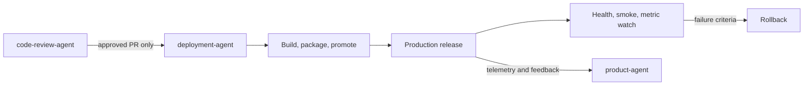

# Deployment Agent

The `deployment-agent` ships reviewed work safely. Its only workflow intake is
accepted and merged task PRs from `code-review-agent`; its output is a verified live release
with a deployment and rollback record.

## Workflow position

## Inputs

- All in-scope accepted and merged task PRs from `code-review-agent`.
- Versioned source and release configuration.
- Environment promotion and infrastructure definitions.
- Secret-manager references, never repository credentials.
- Predefined verification and rollback criteria.

## Outputs

- The live production release.
- Signed/versioned packages or deployable artifacts.
- Deployment record: version, artifact, configuration, environment, and
  rollback point.
- Post-deploy health, smoke-test, and metric-watch results.
- Logs, metrics, traces, alerts, and dashboards feeding the product feedback
  loop.

## Deployment method

The same artifact moves from development through staging to production, with
configuration-only differences. Infrastructure is managed as code. Rollback
criteria are defined before deployment and the rollback path is tested.

If `spec_validation.red_team_mode` is `pre-release`, deployment invokes the
red-team workflow against a confirmed ephemeral environment using synthetic
data. Its findings are advisory for the current release; confirmed findings
become blocking only through regression tests merged by a human.

## Interactions and boundaries

Deployment cannot bypass test or code-review approval. It does not repair code
or silently create console-managed infrastructure. Production telemetry and
user feedback return to `product-agent` for the next cycle.

## Vault behavior

When enabled, material release approaches, incidents, rollback decisions,
problems, and implementation notes are recorded as linked semantic notes. No
secrets, tokens, or credentials may enter the vault.

## Completion and handoff

A deployment completes when the approved artifact is live, verification and
watch-window checks pass, the deployment/rollback record is complete, and the
observability feedback path is active. Failed criteria trigger the predefined
rollback response.

<!-- agent-auditor:inventory:start -->

## Audited agent inventory

- Source: [`deployment-agent`](../../../agents/deployment-agent/deployment-agent.md)
- Subagents: none

<!-- agent-auditor:inventory:end -->
