# Deployment Agent

> Source contract: [`deployment-agent.md`](../../../agents/deployment-agent/deployment-agent.md). The source contract is authoritative if this summary and the contract differ.

## What it does

The shipper. Consumes the approved PR and executes CI/CD - build, packaging, environment promotion, deploy to production, post-deploy verification - with rollback as the safety artifact. Output is the live release. Closes the outer loop by routing production telemetry and user feedback to product-agent.

## How it interacts with other agents

- **Upstream:** receives an explicitly approved merged pull request from `code-review-agent`; no other change artifact is a valid release intake.
- **Downstream:** hands the verified release and deployment record to operations and routes post-launch telemetry and user feedback to `product-agent`.
- **Outer loop:** post-launch telemetry and user feedback route to `product-agent` for the next cycle.

## Agent Page Diagram

```mermaid
flowchart LR
    subgraph inputs["Inputs"]
        approvedMergedPr["Required: Approved Merged PR"]
        releaseConfiguration["Required: Release Configuration"]
        preDeploymentScript["Optional: Pre-Deployment Script"]
        postDeploymentScript["Optional: Post-Deployment Script"]
        priorReleaseState["Optional: Prior Release State"]
        preReleaseEvidence["Optional: Pre-Release Evidence"]
    end
    deploymentAgent["Deployment Agent"]
    subgraph outputs["Outputs"]
        liveRelease["Output: Live Release"]
        deploymentRecord["Output: Deployment Record"]
        rollbackArtifact["Output: Rollback Artifact"]
        postDeployEvidence["Output: Post-Deploy Evidence"]
    end

    inputs --> deploymentAgent --> outputs
```

## Input artifacts

| Artifact | Requirement | Type | Purpose |
|---|---|---|---|
| `approved_merged_pr` | Required | `repository_reference` | Reviewed and explicitly approved merged change. |
| `release_configuration` | Required | `file` | YAML release manifest following references/release_configuration_sample. |
| `workflow_configuration` | Required | `file` | Production release and pre-release gate configuration. |

| Artifact | Requirement | Type | Purpose |
|---|---|---|---|
| `pre_deployment_script` | Optional | `file` | Reviewed script run before application deployment, such as an approved Terraform infrastructure apply. |
| `post_deployment_script` | Optional | `file` | Reviewed script run after deployment, such as an approved database setup, migration, or reference-data population. |
| `prior_release_state` | Optional | `structured_data` | Current deployment, rollback point, and operational baseline. |
| `pre_release_evidence` | Optional | `structured_data` | Security, compliance, or advisory red-team evidence. |

## Output artifacts

| Artifact | Type | Purpose |
|---|---|---|
| `live_release` | `deployment_reference` | Verified production release or explicit blocked/rolled-back outcome. |
| `deployment_record` | `structured_data` | Version, artifact, target, approvals, timing, and outcome. |
| `rollback_artifact` | `structured_data` | Tested rollback point, criteria, and execution result. |
| `post_deploy_evidence` | `structured_data` | Health, smoke-test, telemetry, and watch-window results. |

## Artifact locations

No fixed repository output path is declared. Artifacts are returned through the invoking workflow, existing branch or pull request, configured backlog, CI/CD system, or another location explicitly supplied at runtime.

## Usage notes

- Invoke this agent only within the scope and activation rules defined in [`deployment-agent.md`](../../../agents/deployment-agent/deployment-agent.md).
- Preserve artifact traceability across handoffs; do not substitute summaries for required source evidence.
- Follow repository approval, security, validation, and failure-routing rules before declaring the work complete.

## Documentation source

This page is synchronized from [the canonical agent contract](../../../agents/deployment-agent/deployment-agent.md) and its companion README. Update the canonical contract first when behavior changes.
