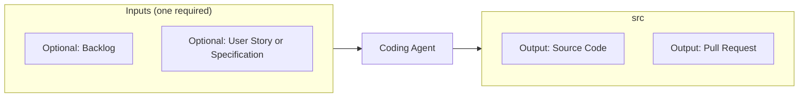

# Developer Agent

> Source contract: [`developer-agent.md`](../../../agents/developer-agent/developer-agent.md). The source contract is authoritative if this summary and the contract differ.

## What it does

The orchestrator of implementation. Pulls sprint-ready tasks from the backlog or implements one supplied user story or specification, and delegates to fe-developer, be-developer, and data-developer subagents, coordinating so the pieces integrate. Uses the existing code and tests as implicit inputs and produces code on feature branches. Also the return address for both feedback loops - failed tests and requested review changes land here (absorbs code-fixer). The Developer Agent is responsible for invoking the Spec Validation Agent, then the Test Agent to run the test suite, and finally the Documentation Agent.

## How it interacts with other agents

- **Upstream:** receives the next approved, unblocked item and its traceability chain from `project-planner-agent`.
- **Downstream:** submits an integrated candidate to specification and test gates, invokes `documentation-agent` after tests pass, then hands the documented branch or pull request to `code-review-agent`.
- **Feedback loops in:** `tests fail` (from test-agent, with diagnostics) and `changes requested` (from code-review-agent, with actionable comments). Fix, then resubmit through the same gate that bounced the work.

## Agent Page Diagram

## Input artifacts

| Artifact | Requirement | Type | Purpose |
|---|---|---|---|
| `repository_state` | Required | `repository_state` | Current codebase, task branch, and existing delivery state. |
| `workflow_configuration` | Required | `file` | Plan, Git, security, judge, and PR gate configuration. |

| Artifact | Requirement | Type | Purpose |
|---|---|---|---|
| `backlog_item` | Optional | `file_or_structured_data` | Approved backlog and complete requirements traceability. |
| `user_story_or_specification` | Optional | `file_or_directory` | A single user story or specification to implement instead of the backlog. |
| `feedback_context` | Optional | `structured_data` | Test, security, specification, or review findings for a revision. |

## Output artifacts

| Artifact | Type | Purpose |
|---|---|---|
| `implementation_plan` | `file_or_structured_data` | Approved and recorded file-level implementation plan. |
| `source_code` | `repository_state` | Source code added or updated under `src/` with focused validation evidence. |
| `validation_handoff` | `structured_data` | Candidate revision and traceability for specification and test gates. |
| `review_candidate` | `repository_reference` | Validated branch or pull request ready for code review. |

## Artifact locations

The contract declares or references these repository locations:

- `src/`

## Usage notes

- Invoke this agent only within the scope and activation rules defined in [`developer-agent.md`](../../../agents/developer-agent/developer-agent.md).
- Preserve artifact traceability across handoffs; do not substitute summaries for required source evidence.
- Follow repository approval, security, validation, and failure-routing rules before declaring the work complete.

## Documentation source

This page is synchronized from [the canonical agent contract](../../../agents/developer-agent/developer-agent.md) and its companion README. Update the canonical contract first when behavior changes.
