# Developer Agent

The `developer-agent` is the implementation orchestrator in the agent-driven
SDLC. It pulls sprint-ready work from the task backlog, prepares an
implementation plan for human approval, coordinates the appropriate developer
subagents, integrates their work, and hands a verified feature branch to the
`test-agent`.

It is also the return point for failed tests and code-review change requests.
The same planning and approval gate applies to those fixes.

## Position in the workflow

```mermaid
flowchart LR
    PP[project-planner-agent] -->|one task| TA[test-agent]
    TA -->|test plan and failing scripts| DA[developer-agent]
    DA -->|implementation plan| HU[User approval]
    HU -->|explicit approval| VA[Save exact plan to vault]
    VA -->|record succeeds or vault is disabled| GIT[Resolve Git workflow mode]
    GIT -->|source code| TA2[test-agent]
    TA2 -->|FAIL with context and tracked IDs| DA
    TA2 -->|PASS| SV[spec-validation-agent]
    SV -->|CONFORMANT| DOC[documentation-agent]
    SV -. DRIFT .-> DA
    DOC --> SEC[security-check-agent]
    SEC -->|PASS| CR[code-review-agent]
    CR -->|changes requested| DA
    CR -->|PR approved| PP2[project-planner-agent]
    PP2 -->|task Done; next dispatched| TASKS[task backlog]
    DA -->|mis-scoped task or bad dependency| PP
```



## Inputs

The developer-agent receives:

| Input | Source | Purpose |
|---|---|---|
| Sprint-ready backlog task | `project-planner-agent` | Defines the work, ordering, dependencies, complexity, estimate, and traceability. This is the only normal intake path. |
| Acceptance criteria | `ba-agent`, linked through the backlog | Defines the behavior that the implementation and acceptance tests must satisfy. |
| Technical tasks and ADRs | `architect-agent` | Supply the implementation decomposition and binding architectural constraints. |
| UX and design specifications | `ux-agent` | Define user-facing behavior, interaction, and visual constraints. |
| Test failures | `test-agent` | Provide reproduction, expected/actual behavior, violated criteria, sanitized diagnostics, impact, confidence, suspected component, and linked backlog IDs. |
| Review change requests | `code-review-agent` | Identify correctness, security, maintainability, or ADR-conformance changes required before approval. |

The agent does not silently accept ad hoc work outside the backlog. If an
implementation reveals that a task is mis-scoped or has an incorrect
dependency, the developer-agent reports that finding to the
`project-planner-agent` instead of silently re-planning the backlog.

## Mandatory plan and approval gate

Every implementation task follows this sequence, including trivial or
single-file changes and fixes returned by testing or code review:

1. Draft a Markdown implementation plan.
2. List every file to create or modify and explain why each change is needed.
3. Describe the implementation approach and acceptance criteria.
4. Present the plan to the user.
5. Wait for explicit approval.
6. Save the exact approved plan to the configured vault.
7. Begin implementation only after the plan is recorded successfully, or after
   the recorder confirms that vault integration is disabled.

Silence, backlog readiness, earlier discussion, or approval of a different plan
does not count as approval. If the scope or approach changes after approval,
the agent stops, presents the revised plan, obtains explicit approval again,
and records the newly approved version before continuing.

## Saving approved plans to the vault

The agent reads the `obsidian_vault` settings in
`ADLC_workflow_settings.json`. After approval it records the exact Markdown
plan with:

```bash
python3 scripts/helper-scripts/vault-event.py record \
  --kind plan \
  --summary "<task>" \
  --details-file <approved-plan.md> \
  --agent developer-agent
```

Related canonical artifacts are supplied with repeated `--artifact` arguments
when available. The recorder creates a Markdown note under the vault's
`Implementation-Plans/` folder and adds it to the vault index.

- If the vault is enabled, failure to record the approved plan blocks
  implementation and must be reported to the user.
- If the vault is disabled, the recorder intentionally performs no write and
  implementation may continue after explicit approval.
- Plans and command arguments must never contain secrets or credentials.

## Build and integration

After the approval and vault gate, the developer-agent:

- `always-branch-and-pr` creates one short-lived branch for the task and, after
  test PASS and documentation, opens one task PR.
- `ask-branch-and-pr` asks the user whether to use that branch-and-PR flow.
- `current-branch` implements on the current non-`main` branch and does not
  create a PR automatically.

1. Resolves `developer_git_workflow.mode` from
   `ADLC_workflow_settings.json` once for the task.
2. Works on one traceable backlog task, one branch, and one pull request at a time.
3. Creates a short-lived branch, asks the user, or uses the current non-`main`
   branch according to the selected mode. No mode permits work directly on
   `main`.
4. Routes implementation to the appropriate active developer subagent:
   `fe-developer`, `be-developer`, or `data-developer`.
5. Activates a dormant specialist only when its documented activation
   condition matches the backlog task or ADRs.
6. Coordinates shared seams, such as API contracts or data-model boundaries,
   rather than allowing subagents to change them independently.
7. Enforces acceptance criteria, ADRs, repository conventions, and the minimal
   change principle.
8. Starts with codebase archaeology for brownfield work.
9. Begins only after `test-agent` supplies the approved plan and failing tests,
   then integrates the result and hands it back for independent verification.
10. When `security_check.pre_commit` is enabled, requires
    `security-check-agent` PASS on the exact staged diff, then runs configured
    pre-commit hooks and commits with its backlog identifier and a
    `Generated-by: <provider>/<model>` provenance trailer. A hook failure stops
    finalization.
12. When the resolved mode requires a PR and `security_check.pre_pr` is enabled,
    requires a fresh security-check PASS on the complete branch diff, then runs
    configured pre-PR hooks, pushes, and creates one PR. Any FAIL/BLOCKED or
    hook failure stops finalization.
13. Hands the validated branch or PR to `code-review-agent`, then stays on the
    task branch or switches to updated `main` according to
    `developer_git_workflow.post_pr_branch`.

The developer-agent owns orchestration and integration. Developer subagents
implement their assigned portions, but they do not bypass the approved plan or
independently redefine scope.

## Outputs

The primary outputs are:

- Implemented code on a feature branch.
- Tests added during development where required by the repository's test-first
  rules.
- Focused verification results and a self-audited diff.
- Traceable commits with the required provenance trailer.
- An approved plan stored as a Markdown note in the vault when enabled.
- A handoff to `test-agent` containing the feature branch and the original
  acceptance-criteria context.
- A validated branch or PR handed to `code-review-agent` after test PASS,
  according to `developer_git_workflow.mode`.

Depending on project settings, the agent may also produce advisory LLM-judge
or specification-drift review artifacts before the test-agent handoff. These
checks supplement rather than replace testing and code review.

## Interaction with the project-planner-agent

The `project-planner-agent` is the sole writer and sequencer of the backlog. It
combines acceptance criteria, technical decomposition, design work,
dependencies, priorities, and estimates into sprint-ready tasks. The
developer-agent consumes those tasks in dependency order and does not skip or
rewrite them.

When implementation evidence shows a scope, dependency, or estimate problem,
the developer-agent sends that signal back to the planner. The planner owns any
re-sequencing or re-estimation of the remaining backlog; the developer-agent
owns only the approved implementation plan for the task currently being built.

## Interaction with the test-agent

The developer-agent sends implemented code to the `test-agent`. The test-agent
independently verifies it against the BA's original acceptance criteria, not
only against the developer's interpretation.

- On `PASS`, the pipeline continues to `spec-validation-agent` for conformance
  check, then to `documentation-agent`, `security-check-agent`, and
  `code-review-agent`. The developer-agent re-enters the loop only on test FAIL
  or code-review CHANGES_REQUESTED.
- On `FAIL`, the test-agent returns complete, sanitized context and, when
  `test_failure_tracking.track_in_backlog` is enabled, planner-created or
  matched Bug/investigation Task IDs.
- The developer-agent prepares a targeted revised plan mapping evidence,
  criteria, files, validation, and tracked IDs; presents it for explicit user
  approval; saves the approved plan to `Implementation-Plans/`; applies only
  the approved fix on the same branch; and returns it to testing.
- The test-agent then reruns the full affected suite, not only the previously
  failing case.
- Existing branches and PRs are reused for all feedback; fixes never create a
  duplicate branch or replacement PR. If post-PR behavior switched to `main`,
  the developer switches back to the existing task branch for review fixes.

Commit, push, and PR creation reads `run_pre_commit_hooks`, `run_pre_pr_hooks`,
and `post_pr_branch` from `developer_git_workflow`. Missing or invalid hook
flags fail safe to enabled; missing or invalid branch behavior fails safe to
`stay-on-task-branch`. Pre-PR hooks run only when a PR will be created.
It also reads `security_check.pre_commit` and `security_check.pre_pr`; missing
or invalid flags fail safe to enabled. Security-check and test red-team
findings use the same explicit revised-plan approval, vault persistence,
deduplicated tracking, targeted fix, and full-gate rerun as other failures.

The same loop applies when `code-review-agent` requests changes: every returned
fix is planned, approved, recorded, implemented, and resubmitted through the
gate that returned it.

## Completion boundary

The developer-agent's implementation phase is complete only when the approved
scope is implemented, required developer-side tests pass, the diff contains no
unrelated changes, and the feature branch is ready for independent verification
by the `test-agent`. Passing developer-side checks does not replace the
test-agent or code-review-agent gates.

<!-- agent-auditor:inventory:start -->

## Audited agent inventory

- Source: [`developer-agent`](../../../agents/developer-agent/developer-agent.md)
- Subagents:
  - `be-developer` — Backend subagent of developer-agent. Implements APIs, services, integrations, and AI/LLM features per the ADRs.
  - `blockchain-developer` — Blockchain subagent of developer-agent. Implements smart contracts, DeFi primitives, NFTs, and Web3 DApp tasks per ADRs, with security patterns and gas optimization built in. Dormant until a Web3 product enters scope.
  - `data-developer` — Data subagent of developer-agent. Implements pipelines, transformations, warehouse models, and database work - the GCP/BigQuery-centric core of the dsfb stack. Absorbs database-engineer.
  - `databricks-developer` — Databricks subagent of developer-agent. Implements lakehouse tasks - Delta Lake, Unity Catalog, Spark jobs, ingestion, notebooks - per data-architecture ADRs. Dormant until a Databricks engagement is active. Sibling of data-developer (data-developer owns GCP/BigQuery core; databricks-developer owns…
  - `embedded-developer` — Embedded/firmware subagent of developer-agent. Implements resource-constrained microcontroller firmware, RTOS applications, HAL, and low-level peripheral code per ADRs. Dormant until firmware work enters scope. Pairs with iot-developer (iot-developer owns cloud/connectivity, embedded-developer owns…
  - `fe-developer` — Frontend subagent of developer-agent. Implements UI tasks from design specs within the design system, meeting the accessibility criteria attached by ux-agent.
  - `iot-developer` — IoT subagent of developer-agent. Implements device-to-cloud IoT tasks - edge ingestion, connectivity, fleet/provisioning code - per ADRs. Dormant until an IoT product enters scope.
  - `mobile-developer` — Mobile subagent of developer-agent. Implements iOS/Android native and cross-platform tasks from design specs and ADRs. Dormant until a mobile product enters scope.

<!-- agent-auditor:inventory:end -->
