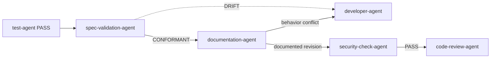

# Documentation Agent

`documentation-agent` documents one verified implementation task after
`spec-validation-agent` confirms CONFORMANT and before `code-review-agent`
begins review.

## Workflow position

## Inputs

- The exact tested, spec-conformant task revision and current PASS evidence.
- Conformance approval from `spec-validation-agent` (DOC runs only after SPEC
  confirms CONFORMANT).
- Its backlog item, specification, acceptance criteria, ADRs, and UX constraints.
- Repository documentation conventions.

## Outputs

The same task revision with accurate required code documentation, or a justified
no-change record, plus a traceable handoff for code review.

## Ownership boundaries

The agent owns documentation accuracy, not implementation behavior. It uses the
existing task branch and PR and never creates a separate documentation PR.

## Completion and handoff

Required documentation is validated against the tested implementation and sent
to `code-review-agent`. Executable changes return through development and testing.

<!-- agent-auditor:inventory:start -->

## Audited agent inventory

- Source: [`documentation-agent`](../../../agents/documentation-agent/documentation-agent.md)
- Subagents: none

<!-- agent-auditor:inventory:end -->
