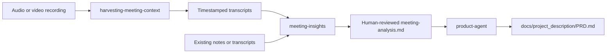

# Meeting Evidence with Product Agent

Use meeting recordings, transcripts, or written notes as traceable evidence for
product envisioning. The final deliverable is a human-reviewed
`meeting-analysis.md` that `product-agent` can cite when creating or revising
`docs/project_description/PRD.md`.

## Choose the input path



| Available material | First step |
|---|---|
| MP3, M4A, WAV, or MP4 recordings | Transcribe with `harvesting-meeting-context`, then analyze with `meeting-insights`. |
| Existing transcript with speakers or timestamps | Analyze directly with `meeting-insights`. |
| Plain meeting notes | Analyze directly, accepting line citations where timestamps are unavailable. |
| A mixture of recordings and notes | Transcribe the recordings, then analyze all relevant material as explicitly identified sources. |

## Recommended project layout

```text
docs/
├── project_meetings_recordings/
│   └── discovery-kickoff/              # Original recordings; restrict access as needed
├── project_meetings/
│   └── batches/discovery-kickoff/       # Transcripts, metadata, and transcription audit
└── project_description/
    ├── evidence/discovery-kickoff/
    │   └── meeting-analysis.md           # Reviewed evidence used by product-agent
    └── PRD.md
```

Keep raw recordings and sensitive transcripts out of the PRD. Follow the
project's consent, access, retention, and Git policies; do not commit recordings
or sensitive personal information merely because they were used as evidence.

## Path A: start with recordings

1. Put recordings for one research scope in a dedicated folder, for example:
   `docs/project_meetings_recordings/discovery-kickoff/`.
2. Ask the agent to transcribe that batch:

   ```text
   Use $harvesting-meeting-context on recordings in
   docs/project_meetings_recordings/discovery-kickoff/.
   Set output_path to docs/project_meetings/ and batch_id to discovery-kickoff.
   Use local transcription and do not install missing dependencies without my approval.
   ```

   Replace the last sentence when cloud transcription or automatic dependency
   installation is intentionally allowed. Local transcription still processes
   potentially sensitive content on the machine; it does not remove consent or
   retention obligations.
3. Review the transcription audit and spot-check names, terminology, timestamps,
   missing chunks, and low-confidence passages. Repair transcription failures
   before product synthesis.
4. Ask `meeting-insights` to create the product-evidence analysis from the
   completed batch transcripts:

   ```text
   Use $meeting-insights on the transcripts under
   docs/project_meetings/batches/discovery-kickoff/transcripts/.
   Create docs/project_description/evidence/discovery-kickoff/meeting-analysis.md
   for product envisioning. Preserve timestamp citations, disagreements,
   unknowns, and evidence classifications. Do not treat opinions as validation.
   ```

The transcription skill's batch-level analysis is a useful extraction input,
but it is not a substitute for the reviewed product-evidence analysis.

## Path B: start with notes or transcripts

Store the source in an access-appropriate project location, then invoke the
analysis directly:

```text
Use $meeting-insights on docs/research/kickoff-notes.md.
Create docs/project_description/evidence/discovery-kickoff/meeting-analysis.md
for product-agent. Cite timestamps where present and speaker plus line number
otherwise. Mark missing owners, dates, consent status, and source details as
UNKNOWN instead of guessing.
```

For several interviews or meetings, identify exactly which files belong to the
same study or decision context. Do not silently combine unrelated audiences,
time periods, or product questions.

## Verify the analysis

Before giving the file to `product-agent`, a human reviewer should confirm:

- decisions are closed choices, not proposals or historical references;
- action owners and dates match the source;
- questions answered later are not left open;
- every material finding has a timestamp or line citation;
- observations, participant opinions, team assumptions, and interpretations
  remain distinct;
- disagreements and contrary evidence remain visible;
- sensitive personal information has been removed when it is unnecessary; and
- the `Supports` and `Does not establish` statements accurately limit the
  evidence.

Change `Analysis status` to `human-verified` and record the reviewer only after
this check. A generated draft must not claim verification.

## Create or revise the PRD

Invoke `product-agent` with the reviewed evidence path:

```text
Use product-agent to create or revise docs/project_description/PRD.md.
Use the reviewed meeting evidence at
docs/project_description/evidence/discovery-kickoff/meeting-analysis.md.
Trace supported findings into the relevant PRD sections and Evidence and
Feedback Sources. Preserve assumptions, contradictions, and follow-up gaps.
Do not copy raw recordings, sensitive personal data, or unsupported conclusions
into the PRD.
```

`product-agent` may use meeting evidence to shape the problem statement, target
users, desired outcomes, constraints, success signals, assumptions, open
questions, and PRD risk analysis. It must corroborate material market or user
claims where the meetings alone do not establish them.

## Expected handoff

The flow is complete when:

- the selected sources and analysis scope are recorded;
- `meeting-analysis.md` is human-verified and traceable to its sources;
- the PRD cites the reviewed analysis and labels evidence limitations;
- raw recordings and unnecessary personal data are absent from the PRD; and
- unresolved evidence gaps have an owner or explicit follow-up plan.
