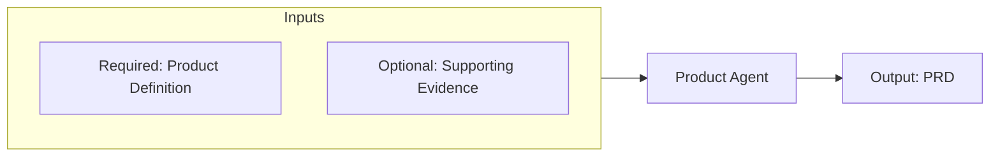

# Product Agent

> Source contract: [`product-agent.md`](../../../agents/product-agent/product-agent.md). The source contract is authoritative if this summary and the contract differ.

## What it does

Owns the WHY of the project - product envisioning, market research, competitive benchmarking, user feedback synthesis, and configurable pre-mortem risk analysis. Entry point of the SDLC workflow. Produces the PRD (docs/project_description/PRD.md) consumed by ba-agent. Use at kickoff, when evaluating a product direction, or when synthesizing production feedback into the next cycle.

## How it interacts with other agents

- **Consumes:** market signals, competitor analyses, stakeholder input, reviewed meeting analyses, and (post-launch) production telemetry and user feedback.
- **Produces:** the **PRD** at `docs/project_description/PRD.md` (per `references/prd-template.md`): problem statement, goals with success metrics, target users, market/competitive landscape, strategic priorities, differentiation, high-level capabilities, constraints, and PRD Risk Analysis.
- **Hands over to:** `ba-agent` (the PRD is its primary input).
- **Receives back:** user feedback from production (outer loop) - synthesize it into the next vision revision.

## Agent Page Diagram

## Input artifacts

| Artifact | Requirement | Type | Purpose |
|---|---|---|---|
| `product_definition_source` | Required | `file_or_directory` | Product definition directory or file containing the product brief, project context, goals, constraints, or existing product definition. |

| Artifact | Requirement | Type | Purpose |
|---|---|---|---|
| `supporting_evidence` | Optional | `file_or_directory` | Reviewed meeting analyses, market research, competitor analysis, customer feedback, telemetry, and other supporting product evidence. |

## Output artifacts

| Artifact | Type | Purpose |
|---|---|---|
| `prd_file` | `file` | Approved Product Requirements Document handed to the BA Agent. |

## Artifact locations

No fixed repository output path is declared. Artifacts are returned through the invoking workflow, existing branch or pull request, configured backlog, CI/CD system, or another location explicitly supplied at runtime.

## Usage notes

- Invoke this agent only within the scope and activation rules defined in [`product-agent.md`](../../../agents/product-agent/product-agent.md).
- Preserve artifact traceability across handoffs; do not substitute summaries for required source evidence.
- Follow repository approval, security, validation, and failure-routing rules before declaring the work complete.

## Documentation source

This page is synchronized from [the canonical agent contract](../../../agents/product-agent/product-agent.md) and its companion README. Update the canonical contract first when behavior changes.
