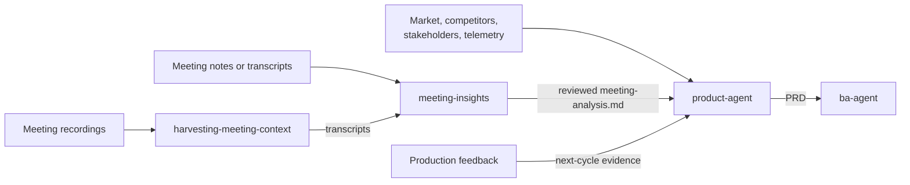

# Product Agent

The `product-agent` owns the **why** of the product. It is the entry point to
the SDLC: it turns evidence from the market, stakeholders, users, and
production into a measurable product vision for the `ba-agent`.

## Workflow position

## Inputs

| Input | Source | Use |
|---|---|---|
| Market signals and research | Public and commissioned research | Establish demand, trends, and risks. |
| Competitor analysis | Benchmarks and product evidence | Identify positioning and differentiation. |
| Stakeholder input | Interviews, meetings, and business context | Clarify goals, constraints, and strategic priorities. |
| Reviewed meeting analysis | `meeting-insights`, optionally after recording transcription | Supply cited decisions, product evidence, disagreement, assumptions, and unknowns. |
| User feedback and telemetry | Production and research loops | Measure outcomes and revise the vision. |

When information is incomplete, the product-agent summarizes what is already
known and asks only the questions needed to avoid guessing.

For recordings, `harvesting-meeting-context` produces the transcripts and
`meeting-insights` turns them into reviewed product evidence. Existing notes or
transcripts go directly to `meeting-insights`. The product-agent preserves each
finding as an observation, participant opinion, team assumption, or
interpretation and never treats heuristic extraction as validation.

For folder conventions, invocation examples, verification, and PRD handoff,
see [Meeting Evidence with Product Agent](MEETING-EVIDENCE-WITH-PRODUCT-AGENT.md).

## Outputs

The canonical output is `docs/project_description/PRD.md`. It contains:

- Problem statement and target users.
- Goals, each with a measurable success metric.
- Market and competitive landscape.
- Strategic priorities and differentiation.
- High-level capabilities and product constraints.
- Evidence supporting important claims.

The PRD is handed to `ba-agent`. It is revised when evidence changes the
vision; competing append-only visions are not maintained.

## Ownership boundaries

The product-agent defines outcomes and direction. It does not write functional
specifications, acceptance criteria, architecture, implementation tasks, or
code. Those belong respectively to `ba-agent`, `architect-agent`,
`project-planner-agent`, and `developer-agent`.

## Agent interactions

- `ba-agent` consumes the PRD and turns its high-level capabilities into
  unambiguous, testable requirements.
- Production feedback returns to the product-agent for synthesis into the next
  product cycle.
- Unresolved product-purpose questions from downstream agents are routed back
  here; implementation details are not.

## Vault behavior

When the Obsidian vault is enabled, the PRD is mirrored into `PRD/`. Material
product decisions, trade-offs, lessons, and updates are recorded through
`scripts/helper-scripts/vault-event.py`, producing linked notes.
The PRD remains canonical; the vault is its navigation and audit layer.

## Completion and handoff

The product-agent is ready to hand off when the PRD states a supported problem,
target users, measurable goals, strategic priorities, headline capabilities,
and known constraints clearly enough for the BA to specify behavior without
inventing the product vision.

<!-- agent-auditor:inventory:start -->

## Audited agent inventory

- Source: [`product-agent`](../../../agents/product-agent/product-agent.md)
- Subagents: none

<!-- agent-auditor:inventory:end -->
