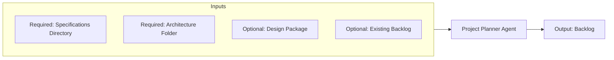

# Project Planner Agent

> Source contract: [`project-planner-agent.md`](../../../agents/project-planner-agent/project-planner-agent.md). The source contract is authoritative if this summary and the contract differ.

## What it does

The arbiter and sequencer. Receives approved specifications including UX requirements, the architecture package, the optional UX design package, and configured test-failure reports; resolves dependencies, sequences work, estimates it, and maintains linked defect history. Sole writer to the Jira or markdown backlog.

## How it interacts with other agents

- **Upstream:** receives approved requirements from `ba-agent`, UX-enriched specifications and the optional design package from `ux-agent`, and technical decomposition from `architect-agent`; receives execution evidence from `test-agent` during delivery.
- **Downstream:** releases the approved ordered backlog and next unblocked item to `developer-agent`, and returns tracking acknowledgements to `test-agent`.
- **One door in:** planning agents write to the backlog only through you. **One door out:** execution agents only pull from the backlog.

## Agent Page Diagram

## Input artifacts

| Artifact | Requirement | Type | Purpose |
|---|---|---|---|
| `requirements_stream` | Required | `files_or_structured_data` | Approved stories and acceptance criteria. |
| `technical_stream` | Required | `files_or_structured_data` | Technical tasks and dependency edges. |
| `backlog_destination` | Required | `structured_data` | Configured Jira or Markdown system of record. |
| `workflow_configuration` | Required | `file` | Backlog approval and failure-tracking configuration. |

| Artifact | Requirement | Type | Purpose |
|---|---|---|---|
| `design_package` | Optional | `directory` | Approved UX design document and wireframes when user-facing design applies. |
| `existing_backlog` | Optional | `files_or_structured_data` | Current items, dependencies, estimates, and statuses. |
| `execution_evidence` | Optional | `structured_data` | Test failures, verification results, and estimate-drift signals. |

## Output artifacts

| Artifact | Type | Purpose |
|---|---|---|
| `backlog` | `repository_or_external_reference` | Backlog containing user stories sequenced by dependencies, then priority and risk. |
| `execution_handoff` | `structured_data` | Next unblocked item and its complete traceability chain. |
| `tracking_updates` | `structured_data` | Defect IDs, lifecycle changes, and completion acknowledgements. |

## Artifact locations

No fixed repository output path is declared. Artifacts are returned through the invoking workflow, existing branch or pull request, configured backlog, CI/CD system, or another location explicitly supplied at runtime.

## Usage notes

- Invoke this agent only within the scope and activation rules defined in [`project-planner-agent.md`](../../../agents/project-planner-agent/project-planner-agent.md).
- Preserve artifact traceability across handoffs; do not substitute summaries for required source evidence.
- Follow repository approval, security, validation, and failure-routing rules before declaring the work complete.

## Documentation source

This page is synchronized from [the canonical agent contract](../../../agents/project-planner-agent/project-planner-agent.md) and its companion README. Update the canonical contract first when behavior changes.
