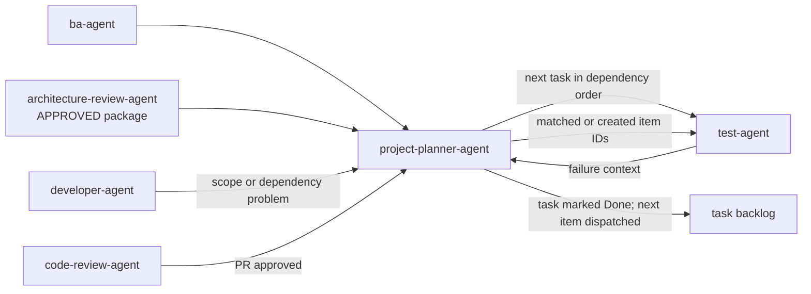

# Project Planner Agent

The `project-planner-agent` is the planning arbiter and execution coordinator. It merges acceptance
criteria, technical decomposition, and design work into one ordered,
dependency-aware, estimated backlog. It is the sole writer to that backlog.

## Workflow position

## Inputs

| Input | Source | Use |
|---|---|---|
| Specs (with embedded acceptance criteria) | `ba-agent` | Provides behavioral traceability and completion conditions. |
| Technical tasks and dependency edges | `architect-agent` | Defines build work and structural ordering constraints. |
| Architecture-review verdict | `architecture-review-agent` | Blocks planning until the exact architecture package is approved. |
| Execution feedback | `developer-agent` and downstream loops | Reveals bad dependencies, repeated bounces, or estimate drift. |
| Test failure and resolution evidence | `test-agent` | Creates or matches traceable defects and closes them only after verification. |
| PR approval | `code-review-agent` | Triggers task completion acknowledgement and dispatch of the next item. |

## Outputs

The output is the task backlog, stored in Jira when it is the system of record
or in `docs/backlog/` Markdown otherwise. Every sprint-ready item includes:

- Source artifact and acceptance-criterion traceability.
- Explicit dependencies, including an empty list when none exist.
- Priority and dependency-aware sequence.
- Complexity estimate and time range.
- Stated estimation assumptions.

The developer-agent pulls work only from this ordered backlog.

When `test_failure_tracking.track_in_backlog` is enabled, test failures add a
deduplicated Bug, or an investigation Task when the cause is not yet confirmed.
The item links to the originating task or story with explicit `Blocks`/`Is
Blocked By` relationships where applicable and retains the test evidence.

## Planning method

1. Merge the BA and architecture streams.
2. Resolve cross-stream dependencies and conflicts before sprint execution.
3. Sequence dependency order first, then priority and risk.
4. Estimate every item using ranges and explicit assumptions.
5. Materialize the ordered plan in the configured backlog system.
6. Re-sequence and re-estimate remaining work when execution evidence warrants
   it.
7. Deduplicate reported test failures, return the existing or created backlog
   ID to the test-agent, and close the item only after the full affected suite
   verifies the resolution.
8. When `project_planner.wait_for_pr_approval` is `true` (the default), mark
   the originating task/story Done and dispatch the next item only after
   `code-review-agent` approves the PR. When `false`, mark Done after test PASS
   and the pre-PR pipeline (SPEC, DOC, SECURITY) clear. Missing or invalid
   values fail safe to `true` and must be reported.
9. Execute tasks in series according to dependency order; each task begins only
   after the previous task's PR is accepted. Release every implementation task
   as its own execution unit with one branch and one pull request.

## Ownership boundaries

The planner owns backlog writing, sequencing, prioritization, and estimates. It
does not define product vision, requirements, architecture, UX, or code.
Upstream agents provide their respective work through this single planning
door; execution agents consume work through the single backlog exit.

## Agent interactions

- Receives specs from `ba-agent` and dependency edges from `architect-agent`.
- Produces sprint-ready tasks for `developer-agent` in dependency order, one at
  a time in series.
- Receives scope and dependency corrections from development rather than
  allowing the developer to silently rewrite the plan.
- Uses repeated test/review bounces and estimate drift as evidence for
  re-planning the remaining backlog.
- Receives sanitized failure context from `test-agent`, deduplicates it against
  open items, creates a Bug or investigation Task when needed, links it to the
  originating work, and returns its ID for the developer's revised plan.
- Records verification evidence from `test-agent` before resolving a tracked
  failure.
- When `project_planner.wait_for_pr_approval` is `true`, keeps the originating
  item incomplete until `code-review-agent` approves the PR, then marks it Done
  and dispatches the next item in dependency order. When `false`, marks Done
  after test PASS and the pre-PR pipeline clears.

The developer-agent's per-task implementation plan is separate: it requires
explicit user approval and vault persistence before building. That plan does
not replace or mutate the planner-owned backlog.

## Vault behavior

When enabled, Markdown backlog artifacts are mirrored into `Backlog/`; Jira
outcomes and material planning decisions are recorded as linked semantic notes.
Estimates, sequencing decisions, assumptions, and
re-planning conclusions should remain traceable to their source artifacts.

## Completion and handoff

Planning is complete when all accepted work is traceable, conflicts are
resolved, dependencies are explicit, every item has complexity and time-range
estimates with assumptions, test failures are deduplicated and linked, verified
resolutions and originating-item completion are recorded, and the backlog is
ordered so the developer-agent can pull the next unblocked task without
inventing sequence or scope.

<!-- agent-auditor:inventory:start -->

## Audited agent inventory

- Source: [`project-planner-agent`](../../../agents/project-planner-agent/project-planner-agent.md)
- Subagents: none

<!-- agent-auditor:inventory:end -->
