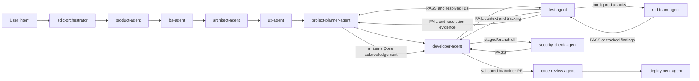

# SDLC Orchestrator

The `sdlc-orchestrator` is the workflow's single routing entry point. It reads
user intent, resolves the canonical target from `routing-registry.yaml`, and
sequences artifact handoffs. It dispatches work but does not perform specialist
work itself.

## Workflow position

## Inputs

- User request and available context.
- `routing-registry.yaml`, the source of truth for targets, triggers, paths,
  workflow order, and artifact handoffs.
- `ADLC_workflow_settings.json` for optional judge and spec-validation behavior,
  developer Git and repository-finalization behavior, and
  test-failure tracking, blocking security checks, and red-team frequency.
- Current workflow artifacts when a request spans phases.

## Routing method

1. Load the registry rather than hardcoding routes.
2. Match intent to the most specific trigger and apply tie-breakers.
3. Load the resolved canonical agent definition.
4. Dispatch the request with context and state the chosen agent and reason.
5. Sequence multi-phase artifact handoffs without skipping the planner.
6. Preserve loops: test PASS and resolved IDs go to planning; planner marks the
   originating and blocking items Done and acknowledges completion; only then
   does development require configured staged-diff security PASS, run
   pre-commit hooks, and commit; configured PR work repeats security assurance
   on the branch before pre-PR hooks and creation. Test-agent runs red-team at
   the configured frequency before PASS. Test/security FAIL or BLOCKED returns
   complete context to
   development and, when configured, planning; review failures return to
   development; production feedback returns to product.

If the user names an agent, it routes directly. General questions need not be
forced into the workflow; ambiguity across phases prompts one clarification.

## Outputs

Each dispatch reports the selected agent, routing reason, expected artifact,
and next consumer. For multi-stage work, the orchestrator coordinates the
handoff chain rather than producing those artifacts itself.

## Interactions and boundaries

Parent agents—not the orchestrator—activate their own specialist subagents.
Consulting SMEs advise but are not workflow stages. Optional LLM-judge and
spec-validation checks are dispatched directly only on explicit request;
otherwise their configured producing agents self-trigger them.

The orchestrator never bypasses the backlog, test gate, review gate, or
deployment intake rule. It does not implement, test, review, or deploy.
Developer work retains its plan/approval/vault gate, resolves one of the three
configured Git modes, and creates a PR only after test PASS when the mode
requires one. Hook failures block their commit or PR step. After PR creation,
the developer stays on the task branch or switches to updated `main` according
to `developer_git_workflow.post_pr_branch`. Test failures retain their
revised-plan approval loop and linked, deduplicated backlog history through
verified resolution and planner completion acknowledgement.
Security-check and red-team failures follow that same loop and never bypass
normal tests or code review. Red-team targets must be confirmed non-production,
local or ephemeral, and synthetic-data only.

## Vault behavior

The orchestrator does not author canonical workflow artifacts. When the vault
is enabled, material routing decisions or issues may be recorded as semantic
events, while the artifact-producing agents remain responsible for recording
their outcomes and the vault agent maintains the graph.

## Completion

Routing completes when the correct target receives sufficient context and the
response states what artifact is expected and where it goes next. Multi-phase
orchestration completes only after each required handoff and feedback loop has
been preserved.

<!-- agent-auditor:inventory:start -->

## Audited agent inventory

- Source: [`sdlc-orchestrator`](../../../agents/sdlc-orchestrator/sdlc-orchestrator.md)
- Subagents: none

<!-- agent-auditor:inventory:end -->
