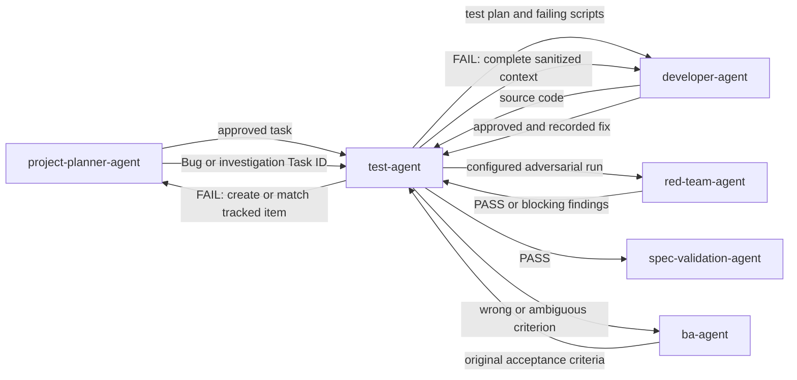

# Test Agent

The `test-agent` is the test-first verifier. It plans and scripts tests before
implementation, then tests code against
the BA's original acceptance criteria, not merely the developer's
interpretation, and gates work into code review.

## Workflow position

## Inputs

| Input | Source | Use |
|---|---|---|
| Implemented feature branch | `developer-agent` | Supplies the code and developer-side tests to verify. |
| Original acceptance criteria | `ba-agent` | Supplies the independent behavioral contract. |
| Project test conventions | Repository | Determines the framework, structure, and supported test layers. |
| Corrected branch after a failure | `developer-agent` | Re-enters the full affected regression suite. |

## Outputs

- Committed unit, integration, acceptance, E2E, accessibility, or data-quality
  tests as appropriate to the change.
- An approved task test plan and relevant failing test evidence before development.
- Acceptance tests mapped one-to-one to acceptance criteria.
- A `PASS` result — the pipeline continues to `spec-validation-agent` for
  conformance check; or
- A `FAIL` result containing reproduction steps, expected and actual behavior,
  violated criteria, sanitized diagnostics, impact, confidence, suspected
  component, and linked backlog identifiers.
- A deduplicated Bug or investigation Task linked to the originating item when
  `test_failure_tracking.track_in_backlog` is enabled.
- A red-team report with attacks, defended controls, safe evidence, regression
  tests, and tracked IDs when `test_red_team.trigger_mode` requires a run.

## Verification method

1. Detect and extend the existing test framework rather than creating a
   parallel harness.
2. Before implementation, create and approve the test plan, write the scripts,
   and demonstrate the expected failing behavior for `developer-agent`.
2. Select test layers appropriate to the behavior and integration seams.
3. Map acceptance coverage directly to BA criteria.
4. Run the affected suites and report failures with complete, sanitized
   diagnostic context to both development and planning when configured.
5. After a developer fix, rerun the full affected suite rather than only the
   formerly failing case.
6. Report the verified resolution to the planner so the tracked failure can be
   closed with evidence.
7. On PASS, hand off to `spec-validation-agent` for conformance check.
8. Run `red-team-agent` at `every-commit` or `every-pr` according to
   `test_red_team.trigger_mode`; `never` disables automatic runs. Missing or
   invalid values fail safe to `every-pr`.
9. Refuse PASS on required red-team FAIL/BLOCKED. Confirmed findings gain
   deterministic regression tests and deduplicated tracked items, then the full
   relevant attack and regression scope reruns after an approved fix.

An acceptance criterion without a test is reported as a finding. Existing
tests are never weakened to make an implementation pass.

## Ownership boundaries

The test-agent verifies behavior; it does not reinterpret requirements or
repair product code. If an acceptance criterion is incorrect or ambiguous, it
escalates to `ba-agent`. Implementation failures return to `developer-agent`.
Red-team attacks are limited to confirmed local or ephemeral targets with
synthetic data; an unconfirmed target blocks a relevant dynamic run. When no
executable attack surface changed, the configured assessment may return an
evidenced not-applicable PASS without a target.

## Agent interactions and feedback loops

- Receives code from `developer-agent` and criteria from `ba-agent`.
- On PASS, hands off to `spec-validation-agent` for conformance check; the
  developer-agent re-enters only on test FAIL or code-review CHANGES_REQUESTED.
- Sends failed work to `developer-agent` with evidence precise enough to plan a
  targeted fix and to `project-planner-agent` for deduplicated tracking when
  `test_failure_tracking.track_in_backlog` is enabled.
- Receives the matched or created Bug/investigation Task IDs from the planner
  and includes them in the developer handoff.
- The developer-agent must apply its mandatory sequence to every returned fix:
  prepare a plan, obtain explicit user approval, save the exact approved plan
  to the vault, implement, verify, and resubmit.
- A requirements defect is resolved with the BA rather than hidden by changing
  the test.
- After the developer's approved fix, reruns the full affected suite and sends
  verification evidence to the planner for tracked-item closure.

## Vault behavior

When enabled, test cases and relevant test artifacts are represented in
`Test-Cases/` and linked to specifications, backlog tasks, implementations, and
reviews. Material test conclusions, failures, problems, and lessons are
recorded through semantic vault events.

## Completion and handoff

Testing is complete when the necessary layers run, every acceptance criterion
has coverage or a reported finding, regression scope is satisfied, and any
configured red-team gate passes. A PASS hands off to `spec-validation-agent`;
a FAIL returns to `developer-agent` with traceable, actionable evidence.

<!-- agent-auditor:inventory:start -->

## Audited agent inventory

- Source: [`test-agent`](../../../agents/test-agent/test-agent.md)
- Subagents:
  - `red-team-agent` — Configurable adversarial testing subagent of test-agent. Before test PASS, attacks a confirmed local or ephemeral synthetic-data target for injection, access-control bypass, credential leakage, prompt injection, unsafe tool use, state abuse, and fail-open behavior. Never targets production. Confirme…

<!-- agent-auditor:inventory:end -->
