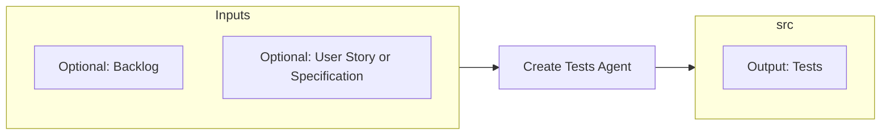

# Test Agent

> Source contract: [`test-agent.md`](../../../agents/test-agent/test-agent.md). The source contract is authoritative if this summary and the contract differ.

## What it does

The verifier. Consumes code plus the ORIGINAL acceptance criteria from ba-agent and writes and runs the test suite (unit, integration, acceptance, E2E, data quality). Emits pass for developer finalization or fail with actionable context to developer-agent and, when configured, project-planner-agent for linked defect tracking.

## How it interacts with other agents

- **Upstream:** receives an exact implementation candidate and traceability chain from `developer-agent`, governed by the original acceptance criteria from `ba-agent`.
- **Downstream:** returns actionable failures to `developer-agent` and, when configured, `project-planner-agent`; after full PASS and planner acknowledgement, returns the validated candidate to `developer-agent` for repository finalization.

## Agent Page Diagram

## Input artifacts

| Artifact | Requirement | Type | Purpose |
|---|---|---|---|
| `candidate_revision` | Required | `repository_state` | Exact implementation revision and affected scope. |
| `acceptance_criteria` | Required | `files_or_structured_data` | Original approved BA verification contract. |
| `governing_context` | Required | `files_or_structured_data` | Sequenced user stories, specifications, ADRs, and UX constraints. |
| `test_environment` | Required | `structured_data` | Authorized environment, data, prerequisites, and commands. |
| `workflow_configuration` | Required | `file` | Test-plan, red-team, and failure-tracking configuration. |

| Artifact | Requirement | Type | Purpose |
|---|---|---|---|
| `user_story_or_specification` | Optional | `file_or_directory` | A single user story or specification to test instead of the whole backlog. |
| `prior_test_evidence` | Optional | `files_or_structured_data` | Approved plans, earlier failures, tracked IDs, and fix evidence. |
| `red_team_target` | Optional | `structured_data` | Confirmed local or ephemeral target with synthetic data. |

## Output artifacts

| Artifact | Type | Purpose |
|---|---|---|
| `test_plan` | `file` | Validated and approved acceptance-criteria coverage plan. |
| `test_suite_changes` | `repository_state` | Tests added or updated under `src/` within repository conventions. |
| `test_result` | `structured_data` | Full evidence and PASS, FAIL, or BLOCKED verdict. |
| `failure_report` | `structured_data` | Actionable secret-safe evidence for developer and planner loops. |
| `completion_handoff` | `structured_data` | PASS evidence and planner acknowledgement for developer finalization. |

## Artifact locations

The contract declares or references these repository locations:

- `src/`
- `docs/test-plans/<feature-name>.md`

## Usage notes

- Invoke this agent only within the scope and activation rules defined in [`test-agent.md`](../../../agents/test-agent/test-agent.md).
- Preserve artifact traceability across handoffs; do not substitute summaries for required source evidence.
- Follow repository approval, security, validation, and failure-routing rules before declaring the work complete.

## Documentation source

This page is synchronized from [the canonical agent contract](../../../agents/test-agent/test-agent.md) and its companion README. Update the canonical contract first when behavior changes.
