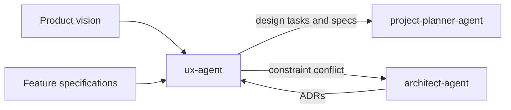

# UX Agent

The `ux-agent` owns the user experience. It turns product context,
specifications, and architectural constraints into implementable design tasks
that are scheduled alongside technical work.

## Workflow position

## Inputs

- ADRs from `architect-agent`, used as real design constraints.
- Product vision for user and outcome context.
- Feature specifications for the behavior and states requiring design.
- Existing design-system conventions and accessibility standards.

## Outputs

The UX agent produces design specifications and planner-ready design tasks,
including:

- User flows and wireframes.
- Component definitions and design-system usage or extensions.
- Interaction patterns.
- Empty, loading, error, and success states.
- Accessibility requirements aligned with WCAG 2.1/2.2.
- Traceability to the relevant feature specification and ADR constraint.

These outputs are handed to `project-planner-agent`, so design work is
sequenced with—not deferred until after—the associated technical work.

## Ownership boundaries

The UX agent owns experience and design requirements, not product strategy,
architecture, backlog sequencing, or implementation. It extends the existing
design system instead of forking it. If an ADR makes a required experience
impossible, UX returns the conflict to `architect-agent` rather than silently
designing around it.

## Agent interactions

- Uses the product vision to preserve user and outcome context.
- Designs within ADRs supplied by `architect-agent`.
- Escalates architecture/design conflicts to the architect.
- Sends design tasks to `project-planner-agent`, which resolves dependencies,
  sequencing, priority, and estimates alongside technical tasks.
- Supplies implementable design constraints that later guide development and
  testing, while not directly controlling either stage.

## Vault behavior

When enabled, canonical design artifacts under `docs/ux/` are mirrored into
`UX/` and linked to the relevant specs, ADRs, backlog items, and test cases.
Material design decisions, accessibility conclusions, trade-offs, and issues
are recorded through semantic vault events and the action log.

## Completion and handoff

UX work is ready for planning when each user-facing feature has complete flows
and states, component and interaction requirements, accessibility criteria,
and explicit links to its specification and architectural constraints. Any
unresolved architecture conflict remains visible and escalated.

<!-- agent-auditor:inventory:start -->

## Audited agent inventory

- Source: [`ux-agent`](../../../agents/ux-agent/ux-agent.md)
- Subagents: none

<!-- agent-auditor:inventory:end -->
