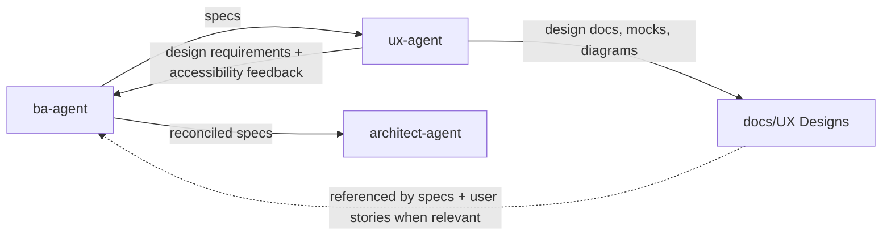

# UX Agent

The `ux-agent` owns user experience design. When `ba-agent` identifies
user-facing scope, UX works concurrently from the approved PRD and returns a
design package for BA reconciliation before architecture.

## Workflow position

## Inputs

- Specifications from `ba-agent` for the user-facing scope being designed.
- Existing design-system conventions and accessibility standards.

## Outputs

The UX agent produces two streams of output:

- Design requirements feedback — interaction constraints, impossible-design
  conflicts, and accessibility requirements — returned to `ba-agent` for spec
  reconciliation before architecture.
- Design artifacts — user flows, wireframes, component definitions, interaction
  patterns, empty/loading/error/success states, and accessibility specifications
  (WCAG 2.1/2.2) — written to `docs/UX Designs/`.

Specs and user stories reference files in `docs/UX Designs/` when they describe
behavior that depends on a specific interaction, component, or visual contract.

## Ownership boundaries

The UX agent owns experience and design requirements, not product strategy,
architecture, backlog sequencing, or implementation. It extends the existing
design system instead of forking it. If a required experience is impossible
within the current constraints, UX returns the conflict to `ba-agent` for
resolution rather than silently designing around it.

## Agent interactions

- Receives specs from `ba-agent` and returns design requirements feedback to
  `ba-agent` for reconciliation.
- Writes design artifacts to `docs/UX Designs/`; BA references those files in
  specs and user stories when relevant.
- Supplies implementable design constraints that later guide development and
  testing, while not directly controlling either stage.

## Vault behavior

When enabled, canonical design artifacts under `docs/UX Designs/` are mirrored
into `UX/` and linked to the relevant specs, ADRs, backlog items, and test
cases. Material design decisions, accessibility conclusions, trade-offs, and
issues are recorded through semantic vault events.

## Completion and handoff

UX work is complete when each user-facing feature has design requirements
feedback returned to `ba-agent`, and when design artifacts are written to
`docs/UX Designs/` with complete flows and states, component and interaction
requirements, accessibility criteria, and traceability to the relevant
specifications. Any unresolved constraint conflict remains visible and
escalated.

<!-- agent-auditor:inventory:start -->

## Audited agent inventory

- Source: [`ux-agent`](../../../agents/ux-agent/ux-agent.md)
- Subagents: none

<!-- agent-auditor:inventory:end -->
