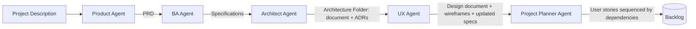
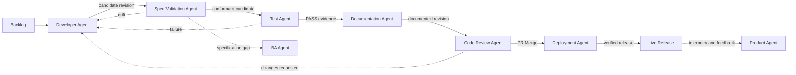

# ADLC Workflow Design

## Design principles

- Artifacts flow forward through explicit ownership boundaries.
- Approval is attached to the current artifact revision and is invalidated by material changes.
- Developer execution is normally reached through the dependency-sequenced backlog; targeted story/specification execution remains an individual-agent usage mode, not an orchestrated bypass.
- Architecture mode is inferred from existing architecture outputs instead of a user-supplied mode field.
- Specification validation, testing, documentation, and code review are distinct gates.
- Deployment consumes an approved merged PR and an explicit release manifest.
- End-to-end workflow orchestration is enforced through `sdlc-orchestrator`; the other agents are intentionally designed so they can also be invoked individually when a bounded task needs that agent directly.

## Definition flow

`Project Description -> Product Definition -> PRD -> Specifications -> Architecture Folder -> Design Package -> Backlog`

## Implementation flow

## Orchestration model

`sdlc-orchestrator` is the only agent that enforces the full Agent-Orchestrated SDLC sequence shown in `agent-orchestrated-sdlc.mmd`. It routes work, sequences artifact handoffs, checks the applicable gates, and resumes from the earliest missing or stale workflow stage.

All other SDLC agents remain independently invokable by design. Direct invocation is appropriate for bounded specialist work, artifact repair, review, or advisory tasks; it does not imply the full workflow has run unless `sdlc-orchestrator` has sequenced and validated the handoffs.

Parent agents own their phase outcomes and coordinate any specialist execution behind that boundary. All development work is owned by `developer-agent`; frontend, backend, data, mobile, IoT, embedded, blockchain, Databricks, framework-specific, and other implementation-specific work is handled through its skills and subagents rather than as separate top-level workflow stages. Similarly, `architect-agent` owns architecture and solutioning; niche architecture domains, platform decisions, data architecture, cloud architecture, and specialized solution work are handled through its skills and subagents. `test-agent` owns testing and verification while using its red-team and testing specialists as needed. Consultant and auxiliary agents provide advice, evidence, validation, or off-workflow support, but they do not replace the owning workflow agent or create a new phase unless `sdlc-orchestrator` explicitly routes them.

## Artifact model

| Group | Artifacts |
|---|---|
| Product | Project description input, `docs/project_description/PRD.md` |
| Requirements | `docs/specs/<feature>.md` |
| Architecture Folder | `docs/architecture/architecture.md`, `docs/architecture/adrs/`, editable diagrams |
| Design Package | `docs/design/design.md`, `docs/design/wireframes/` |
| Planning | Jira or `docs/backlog/`; backlog means user stories sequenced by dependencies |
| Implementation | Source code under `src/`; task branch or Pull Request |
| Spec Validation | Conformance verdict, drift finding, or specification-gap finding |
| Testing | Approved test plan, tests, PASS/FAIL evidence, optional tracked defects |
| Documentation | Documented revision or justified no-change record |
| Review | Pull Request input and PR Merge approval output |
| Deployment | Live Release, Deployment Record, Rollback Artifact, Post-Deploy Evidence |

## Architecture mode detection

Architect Agent selects **Existing Architecture Expansion** only when `docs/architecture/architecture.md` exists and `docs/architecture/adrs/` contains ADR evidence. Otherwise it selects **New Architecture**. Existing Architecture Folder remains optional context; there is no visible Architecture Mode input.

## UI artifact conventions

Input/output groups use yellow dotted borders. Mandatory inputs use orange borders, optional inputs use gray borders, and outputs or output folders use green borders. Agent pages expose a top-right **Run** action.
