# ADLC Design

## Artifact Flow

Ideas + Meeting Notes -> PRD -> {Product Validation Go/No} -> Reconciled Specs + UX Design -> ADR & Architectural Diagrams -> Reviewed ADR & Architectural Diagrams -> Tasks & User Stories -> Project/Feature Implementation Plan -> {Development Go/NoGo} ->

TASK1 from Implementation Plan -> Task Branch -> Test Plan -> Failing Test Scripts -> Code -> TestRun Results -> Code Documentation -> PR -> {PR Acceptance} ->
TASK2 from Implementation Plan -> Task Branch -> Test Plan -> Failing Test Scripts -> Code -> TestRun Results -> Code Documentation -> PR -> {PR Acceptance} ->
...
TASKn from Implementation Plan -> Task Branch -> Test Plan -> Failing Test Scripts -> Code -> TestRun Results -> Code Documentation -> PR -> {PR Acceptance}

Tasks execute in series according to the order and dependencies defined in the implementation plan. Each task begins only after the previous task's PR is accepted.

-> {Deployment Go/NoGo} -> Deploy

### Diagram

```mermaid
flowchart TD
    A([Ideas + Meeting Notes]) --> B[/PRD/]
    B --> C{Product Validation\nGo / No-Go}
    C -->|No-Go| A
    C -->|Go| D[/BA Specs + conditional UX Design/]
    D --> E[/ADR & Architectural Diagrams/]
    E --> F[/Reviewed ADR & Architectural Diagrams/]
    F --> G[/Tasks & User Stories/]
    G --> H[/Project & Feature\nImplementation Plan/]
    H --> I{Development\nGo / No-Go}
    I -->|No-Go| H
    I -->|Go| TASKS

    subgraph TASKS[Sequential Task Execution – ordered by implementation plan dependencies]
        direction TB
        T1[TASK 1] --> TP1[Test Plan] --> TS1[Test Scripts] --> C1[Code] --> TR1[TestRun Results] --> D1[Code Docs] --> PR1[PR] --> PA1{PR Acceptance}
        PA1 -->|No-Go| T1
        PA1 -->|Go| T2[TASK 2]
        T2 --> TP2[Test Plan] --> TS2[Test Scripts] --> C2[Code] --> TR2[TestRun Results] --> D2[Code Docs] --> PR2[PR] --> PA2{PR Acceptance}
        PA2 -->|No-Go| T2
        PA2 -->|Go| Tn[TASK n]
        Tn --> TPn[Test Plan] --> TSn[Test Scripts] --> Cn[Code] --> TRn[TestRun Results] --> Dn[Code Docs] --> PRn[PR] --> PAn{PR Acceptance}
        PAn -->|No-Go| Tn
    end

    TASKS --> DEP{Deployment\nGo / No-Go}
    DEP -->|No-Go| TASKS
    DEP -->|Go| DEPLOY([Deploy])

    classDef doc fill:#dbeafe,stroke:#3b82f6,color:#1e3a5f
    classDef gate fill:#fef9c3,stroke:#ca8a04,color:#713f12
    classDef event fill:#dcfce7,stroke:#16a34a,color:#14532d
    classDef task fill:#f3e8ff,stroke:#9333ea,color:#581c87
    class B,D,E,F,G,H,TP1,TS1,C1,TR1,D1,PR1,TP2,TS2,C2,TR2,D2,PR2,TPn,TSn,Cn,TRn,Dn,PRn doc
    class C,I,PA1,PA2,PAn,DEP gate
    class A,DEPLOY event
    class T1,T2,Tn task
```

## Agentic Intervention Flow

(Ideas + Meeting Notes & Recordings) -[Product Agent]-> (PRD) -> {Product Validation Go/No} -[BA Agent]-> (Initial Specs) -[UX Agent]-> (UX design requirements feedback to BA) + (UX design docs, mocks, diagrams → docs/UX Designs/) -[BA Agent]-> (Reconciled Specs, referencing docs/UX Designs/ when relevant) -[Architect Agent]-> (ADR & Architectural Diagrams) -[Architecture Review Agent]-> (Reviewed ADR & Architectural Diagrams) -[Project Planner Agent]-> (Project/Feature Implementation Plan + Tasks & User Stories, referencing docs/UX Designs/ when relevant) -> {Plan Approval / Development Go/NoGo} ->

-[Project Planner Agent]-> (TASK1 on its own branch) -[Test Agent]-> (Test Plan for task) -[Test Agent]-> (Failing Test Scripts) -[Developer Agent]-> (Code) -[Test Agent]-> (TestRun Results) -[Documentation Agent]-> (Code Documentation) -[Code Reviewer Agent]-> (One PR for TASK1) -> {PR Acceptance} ->
-[Project Planner Agent]-> (TASK2 on its own branch) -[Test Agent]-> (Test Plan for task) -[Test Agent]-> (Failing Test Scripts) -[Developer Agent]-> (Code) -[Test Agent]-> (TestRun Results) -[Documentation Agent]-> (Code Documentation) -[Code Reviewer Agent]-> (One PR for TASK2) -> {PR Acceptance} ->
...
-[Project Planner Agent]-> (TASKn on its own branch) -[Test Agent]-> (Test Plan for task) -[Test Agent]-> (Failing Test Scripts) -[Developer Agent]-> (Code) -[Test Agent]-> (TestRun Results) -[Documentation Agent]-> (Code Documentation) -[Code Reviewer Agent]-> (One PR for TASKn) -> {PR Acceptance}

Tasks execute in series according to the order and dependencies defined in the implementation plan. Each task begins only after the previous task's PR is accepted.

-> {Deployment Go/NoGo} -[Deployment Agent]-> (Deployment log)

### Diagram

```mermaid
flowchart TD
    A([Ideas + Meeting Notes\n& Recordings]) -->|Product Agent| B[/PRD/]
    B --> C{Product Validation\nGo / No-Go}
    C -->|No-Go| A
    C -->|Go\nBA Agent; UX when required| D[/Reconciled Specs + UX Design/]
    D -->|Architect Agent| E[/ADR & Architectural\nDiagrams/]
    E -->|Architecture Review Agent| F[/Reviewed ADR &\nArchitectural Diagrams/]
    F -->|Project Planner Agent| G[/Implementation Plan +\nTasks & User Stories/]
    G --> H{Plan Approval /\nDevelopment Go/NoGo}
    H -->|No-Go| G
    H -->|Go\nProject Planner Agent| TASKS

    subgraph TASKS[Sequential Task Execution – ordered by implementation plan dependencies]
        direction TB
        T1([TASK 1]) -->|Test Agent| TP1[/Test Plan/] -->|Test Agent| TS1[/Test Scripts/] -->|Developer Agent| C1[/Code/] -->|Test Agent| TR1[/TestRun Results/] -->|Documentation Agent| D1[/Code Docs/] -->|Code Reviewer Agent| PR1[/PR/] --> PA1{PR\nAcceptance}
        PA1 -->|No-Go| T1
        PA1 -->|Go\nProject Planner Agent| T2([TASK 2])
        T2 -->|Test Agent| TP2[/Test Plan/] -->|Test Agent| TS2[/Test Scripts/] -->|Developer Agent| C2[/Code/] -->|Test Agent| TR2[/TestRun Results/] -->|Documentation Agent| D2[/Code Docs/] -->|Code Reviewer Agent| PR2[/PR/] --> PA2{PR\nAcceptance}
        PA2 -->|No-Go| T2
        PA2 -->|Go\nProject Planner Agent| Tn([TASK n])
        Tn -->|Test Agent| TPn[/Test Plan/] -->|Test Agent| TSn[/Test Scripts/] -->|Developer Agent| Cn[/Code/] -->|Test Agent| TRn[/TestRun Results/] -->|Documentation Agent| Dn[/Code Docs/] -->|Code Reviewer Agent| PRn[/PR/] --> PAn{PR\nAcceptance}
        PAn -->|No-Go| Tn
    end

    TASKS --> DEP{Deployment\nGo / No-Go}
    DEP -->|No-Go| TASKS
    DEP -->|Go\nDeployment Agent| LOG([Deployment Log])

    classDef doc fill:#dbeafe,stroke:#3b82f6,color:#1e3a5f
    classDef gate fill:#fef9c3,stroke:#ca8a04,color:#713f12
    classDef event fill:#dcfce7,stroke:#16a34a,color:#14532d
    classDef task fill:#f3e8ff,stroke:#9333ea,color:#581c87
    class B,D,E,F,G,TP1,TS1,C1,TR1,D1,PR1,TP2,TS2,C2,TR2,D2,PR2,TPn,TSn,Cn,TRn,Dn,PRn doc
    class C,H,PA1,PA2,PAn,DEP gate
    class A,LOG event
    class T1,T2,Tn task

```

## Legend

- `()` Document outcome
- `-[XX]->` Agent intervention
- `{}` Manual User intervention
