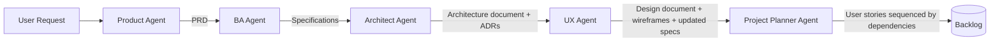
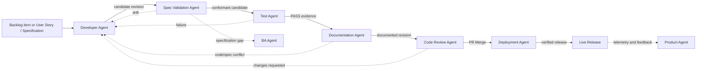

# ADLC Workflow Design

## Design principles

- Artifacts flow forward through explicit ownership boundaries.
- Approval is attached to the current artifact revision and is invalidated by material changes.
- A targeted user story or specification overrides backlog-wide execution for Developer and Test Agents.
- Architecture mode is inferred from existing architecture outputs instead of a user-supplied mode field.
- Specification validation, testing, documentation, and code review are distinct gates.
- Deployment consumes an approved merged PR and an explicit release manifest.

## Definition flow

`User Request -> Product Definition -> PRD -> Specifications -> Architecture Folder -> Design Package -> Backlog`

## Implementation flow

## Artifact model

| Group | Artifacts |
|---|---|
| Product | `docs/project_description/PRD.md` |
| Requirements | `docs/specs/<feature>.md` |
| Architecture Folder | `docs/architecture/architecture.md`, `docs/architecture/adrs/`, editable diagrams |
| Design Package | `docs/design/design.md`, `docs/design/wireframes/` |
| Planning | Jira or `docs/backlog/`; backlog means user stories sequenced by dependencies |
| Implementation | Source code under `src/`; task branch or Pull Request |
| Testing | Approved test plan, tests, PASS/FAIL evidence, optional tracked defects |
| Documentation | Documented revision or justified no-change record |
| Review | Pull Request input and PR Merge approval output |
| Deployment | Live Release, Deployment Record, Rollback Artifact, Post-Deploy Evidence |

## Architecture mode detection

Architect Agent selects **Existing Architecture Expansion** only when `docs/architecture/architecture.md` exists and `docs/architecture/adrs/` contains ADR evidence. Otherwise it selects **New Architecture**. Existing Architecture Folder remains optional context; there is no visible Architecture Mode input.

## UI artifact conventions

Input/output groups use yellow dotted borders. Mandatory inputs use orange borders, optional inputs use gray borders, and outputs or output folders use green borders. Agent pages expose a top-right **Run** action.
