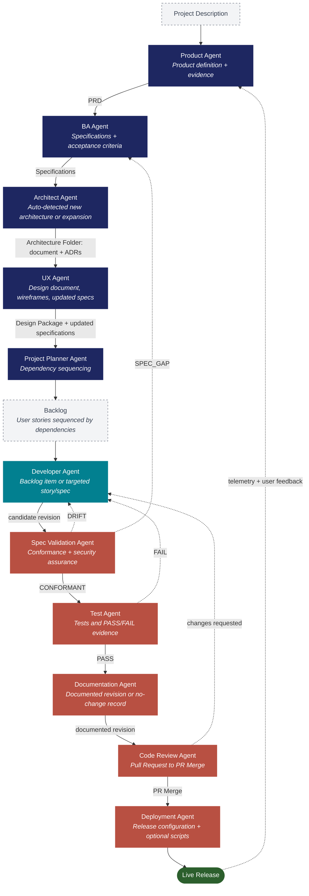

# Agent-Orchestrated SDLC

```mermaid
flowchart TB
    classDef definition fill:#1E2761,stroke:#1E2761,color:#FFFFFF
    classDef build fill:#028090,stroke:#028090,color:#FFFFFF
    classDef assurance fill:#B85042,stroke:#B85042,color:#FFFFFF
    classDef live fill:#2C5F2D,stroke:#2C5F2D,color:#FFFFFF
    classDef artifact fill:#F3F4F6,stroke:#6B7280,stroke-dasharray:4 4,color:#374151

    DESCRIPTION["Project Description"]:::artifact
    PRODUCT["Product Agent<br/><i>Product definition + evidence</i>"]:::definition
    BA["BA Agent<br/><i>Specifications + acceptance criteria</i>"]:::definition
    ARCH["Architect Agent<br/><i>Auto-detected new architecture or expansion</i>"]:::definition
    UX["UX Agent<br/><i>Design document, wireframes, updated specs</i>"]:::definition
    PLANNER["Project Planner Agent<br/><i>Dependency sequencing</i>"]:::definition
    BACKLOG["Backlog<br/><i>User stories sequenced by dependencies</i>"]:::artifact
    DEV["Developer Agent<br/><i>Backlog item or targeted story/spec</i>"]:::build
    SPEC["Spec Validation Agent<br/><i>Conformance + security assurance</i>"]:::assurance
    TEST["Test Agent<br/><i>Tests and PASS/FAIL evidence</i>"]:::assurance
    DOCS["Documentation Agent<br/><i>Documented revision or no-change record</i>"]:::assurance
    REVIEW["Code Review Agent<br/><i>Pull Request to PR Merge</i>"]:::assurance
    DEPLOY["Deployment Agent<br/><i>Release configuration + optional scripts</i>"]:::assurance
    LIVE(["Live Release"]):::live

    DESCRIPTION --> PRODUCT
    PRODUCT -- PRD --> BA
    BA -- Specifications --> ARCH
    ARCH -- "Architecture Folder: document + ADRs" --> UX
    UX -- "Design Package + updated specifications" --> PLANNER
    PLANNER --> BACKLOG
    BACKLOG --> DEV
    DEV -- "candidate revision" --> SPEC
    SPEC -- CONFORMANT --> TEST
    TEST -- PASS --> DOCS
    DOCS -- "documented revision" --> REVIEW
    REVIEW -- "PR Merge" --> DEPLOY
    DEPLOY --> LIVE

    SPEC -. DRIFT .-> DEV
    SPEC -. SPEC_GAP .-> BA
    TEST -. FAIL .-> DEV
    REVIEW -. "changes requested" .-> DEV
    LIVE -. "telemetry + user feedback" .-> PRODUCT
```
