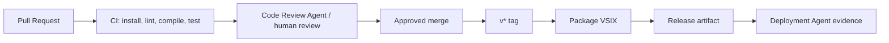

# GitHub Actions Review Notes

These notes review GitHub Actions against the current ADLC workflow. They are
recommendations only; `.github/workflows/` is a frozen zone for agents and
should not be edited without explicit human approval.

## Status

The previous gap analysis was stale. It referenced workflow files and coverage
that do not match the current repository.

## Current Workflow Files

| Workflow file | Trigger | Current behavior | Review finding |
|---|---|---|---|
| `.github/workflows/ci.yml` | Push/PR to `main` | Runs `npm ci`, `npm run lint`, `npm run build`, and `npm test`, but allows commands to echo and continue. | Present but not a hard quality gate. |
| `.github/workflows/cd.yml` | `v*` tags | Echoes deployment to QA. | Placeholder, not a Deployment Agent-aligned release pipeline. |

Important mismatch: `package.json` defines `compile`, `lint`, `test`,
`create-release`, and `bump-version`; it does not define `build`.

## ADLC Alignment

GitHub Actions should support these gates:

```text
Developer -> Spec Validation -> Test -> Documentation -> Code Review -> Deployment
```

Actions should not replace agent ownership. They should provide deterministic
evidence that agents and reviewers can rely on.

## Recommended CI/CD Improvements

| Priority | Improvement | Reason |
|---|---|---|
| P1 | Make CI fail hard on `npm ci`, `npm run lint`, `npm run compile`, and `npm test`. | Current echo-and-continue pattern can hide failures. |
| P1 | Replace `npm run build` with `npm run compile`, or add a real `build` script. | Current workflow references a missing script. |
| P1 | Package VSIX on release tags with `vsce package`. | Matches this project as a VS Code extension. |
| P2 | Add cross-platform test matrix for Linux, macOS, and Windows. | VS Code extensions run across platforms. |
| P2 | Upload `.vsix` as a release artifact. | Makes release evidence reproducible. |
| P2 | Add PR description and conventional commit checks if the team wants server-side policy. | Reinforces repository conventions. |
| P3 | Add deployment evidence to tag workflow. | Aligns `cd.yml` with Deployment Agent outputs. |
| P3 | Add Jira transition automation only after branch naming and issue-key parsing are standardized. | Avoids moving the wrong issue. |

## Suggested Target Pipeline



## Inconsistencies Found

- Prior note claimed `ci.yml` lacked tests; current `ci.yml` includes
  `npm test`, but it is not enforced because failures can be skipped.
- Prior note claimed `build-artifacts.yml` exists; current repo has `cd.yml`
  instead.
- Prior note claimed Docker image publishing to ECR/GCP; current `cd.yml` only
  echoes a QA deployment.
- Prior note claimed audit and secret scan coverage in CI; current workflow does
  not show those deterministic checks.

## Proposed Additions

- Add a review-approved CI contract before changing `.github/workflows/`.
- Decide whether release publishing means Marketplace publishing, GitHub release
  artifact upload, internal VSIX distribution, or all three.
- Add a Deployment Agent release-record schema before expanding CD automation.
