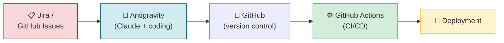
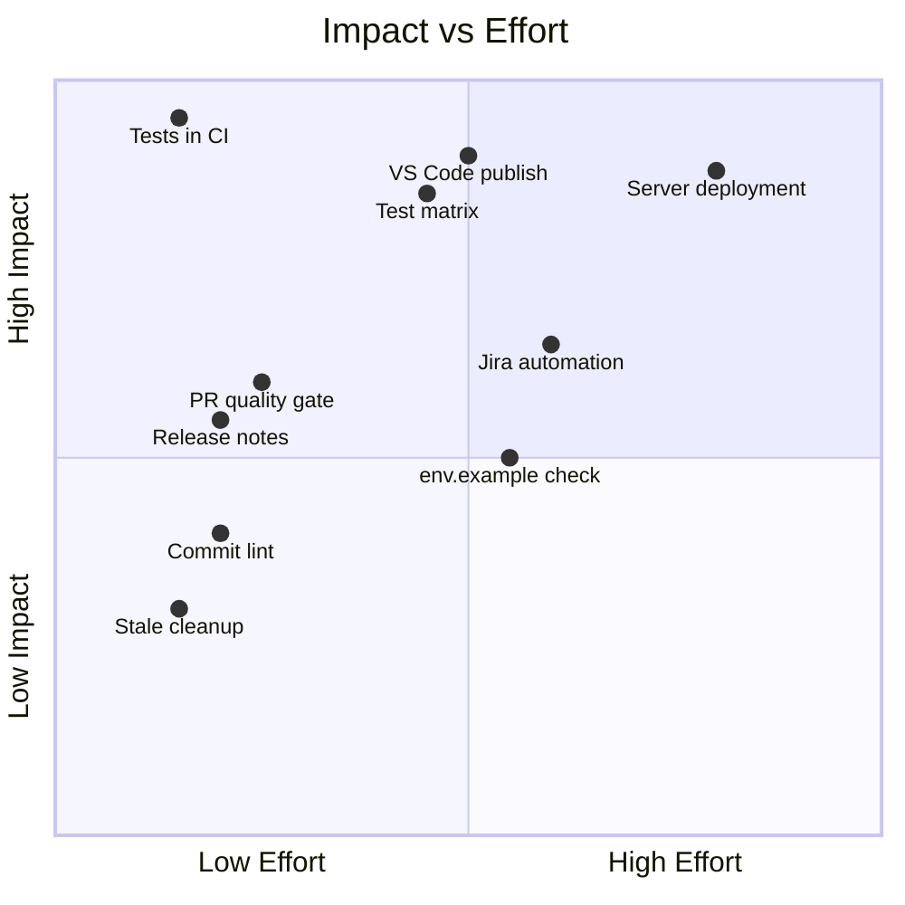
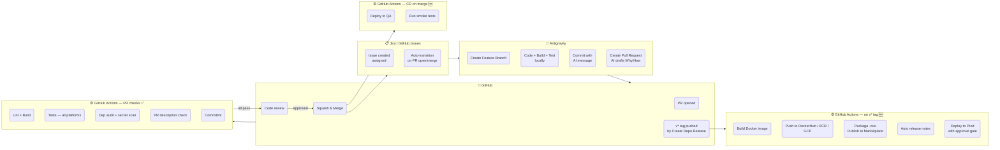

# GitHub Actions — Gap Analysis & Suggestions

Review of the current workflow (Task Runner sidebar + existing Actions) to identify what is missing, what is duplicate effort, and where local actions should be paired with or replaced by server-side automation.

---

## What Is Already Covered

| Workflow file | Trigger | What it does |
|---|---|---|
| `ci.yml` | Push to `main`, PR to `main` | Lint, build, `npm audit`, TruffleHog secret scan, dependency review |
| `build-artifacts.yml` | Push of `v*` tag | Builds Docker image, pushes to AWS ECR / GCP |

These are solid foundations. Everything below builds on top of them.

---

## Current Coverage Map



- 🟢 **GitHub Actions (CI)** — lint, build, audit, secret scan are covered
- 🟡 **Deployment** — Docker build on tag exists; no actual server deployment workflow
- 🔵 **Antigravity** — build/test/commit all run locally only
- 🔴 **Planning** — zero automation connecting Jira/Issues to GitHub events

---

## Gap 1: Tests Are Not Running in CI

**Current state:** `ci.yml` runs lint and build but has no test step. `Run Project Tests` only runs locally in the Task Runner sidebar.

**Risk:** A PR can pass all CI checks and be merged even if it breaks the test suite — the tests only catch failures on the developer's machine.

**Suggested addition** — add a `test` job to `ci.yml`:

```yaml
  test:
    name: Test
    runs-on: ubuntu-latest
    steps:
      - uses: actions/checkout@v4
      - uses: actions/setup-node@v4
        with:
          node-version: 20
          cache: npm
      - run: npm ci
      - run: npm test
```

**Complements:** Task Runner **Run Project Tests** (local fast feedback) + GitHub Actions test job (server-side gate that blocks merge if tests fail).

---

## Gap 2: No Multi-Platform / Multi-Node Test Matrix

**Current state:** Everything runs on `ubuntu-latest` / Node 20 only.

**Risk for a VS Code extension:** Extensions run on Windows, macOS, and Linux. A test that passes on Ubuntu can fail on macOS due to path separators or on Windows due to shell differences.

**Suggested addition** — matrix job:

```yaml
  test-matrix:
    name: Test (${{ matrix.os }} / Node ${{ matrix.node }})
    strategy:
      fail-fast: false
      matrix:
        os: [ubuntu-latest, macos-latest, windows-latest]
        node: [18, 20, 22]
    runs-on: ${{ matrix.os }}
    steps:
      - uses: actions/checkout@v4
      - uses: actions/setup-node@v4
        with:
          node-version: ${{ matrix.node }}
          cache: npm
      - run: npm ci
      - run: npm test
```

**Complements:** Local **Build Project** and **Run Project Tests** (your machine only) + matrix (all target platforms).

---

## Gap 3: No VS Code Extension Publishing

**Current state:** `build-artifacts.yml` handles Docker. There is no workflow that packages and publishes the `.vsix` to the VS Code Marketplace.

**Suggested addition** — publish on `v*` tag (alongside Docker build):

```yaml
name: Publish Extension

on:
  push:
    tags:
      - "v*"

jobs:
  publish:
    name: Publish to VS Code Marketplace
    runs-on: ubuntu-latest
    steps:
      - uses: actions/checkout@v4
      - uses: actions/setup-node@v4
        with:
          node-version: 20
          cache: npm
      - run: npm ci
      - run: npm run compile
      - name: Package extension
        run: npx vsce package
      - name: Publish to Marketplace
        run: npx vsce publish
        env:
          VSCE_PAT: ${{ secrets.VSCE_PAT }}
      - name: Upload .vsix as release artifact
        uses: actions/upload-artifact@v4
        with:
          name: vsix-${{ github.ref_name }}
          path: "*.vsix"
```

**Complements:** Task Runner **Create Repo Release** (creates the tag) → GitHub Actions (packages and publishes to Marketplace automatically from that tag).

---

## Gap 4: No Automated Release Notes

**Current state:** Task Runner **Create Repo Release** creates a tag and optionally a release branch, but the GitHub Release body is empty or minimal.

**Suggested addition** — auto-generate release notes when a `v*` tag is pushed:

```yaml
  release-notes:
    name: Create GitHub Release
    runs-on: ubuntu-latest
    steps:
      - uses: actions/checkout@v4
        with:
          fetch-depth: 0
      - name: Generate release notes
        uses: actions/github-script@v7
        with:
          script: |
            await github.rest.repos.createRelease({
              owner: context.repo.owner,
              repo: context.repo.repo,
              tag_name: context.ref.replace('refs/tags/', ''),
              name: context.ref.replace('refs/tags/', ''),
              generate_release_notes: true
            });
```

**Complements:** Task Runner **Create Repo Release** (triggers the tag) → GitHub auto-builds the release page from merged PR titles and labels.

---

## Gap 5: No Server Deployment Workflow

**Current state:** `build-artifacts.yml` builds the Docker image but does not deploy it anywhere. Server deployment is manual.

**Suggested addition** — deployment stages triggered by the image being pushed:

```yaml
name: Deploy

on:
  workflow_run:
    workflows: ["Build Artifacts"]
    types: [completed]

jobs:
  deploy-qa:
    name: Deploy to QA
    if: ${{ github.event.workflow_run.conclusion == 'success' }}
    runs-on: ubuntu-latest
    environment: qa
    steps:
      - name: Deploy to QA server
        run: |
          # ssh deploy command or kubectl rollout or docker compose pull
          echo "deploy $IMAGE_TAG to QA"

  deploy-prod:
    name: Deploy to Production
    needs: deploy-qa
    runs-on: ubuntu-latest
    environment: prod        # requires manual approval gate in GitHub Environments
    steps:
      - name: Deploy to Production
        run: |
          echo "deploy $IMAGE_TAG to Production"
```

**Complements:** Task Runner **Environment Switch** (local config switch) + GitHub Environments with required reviewers (server-side production gate requiring explicit approval).

---

## Gap 6: Jira Transitions Are Entirely Manual

**Current state:** Moving a Jira item to `In Progress`, `In Review`, or `Done` requires clicking Task Runner sidebar items manually.

**Suggested addition** — auto-transition Jira via GitHub webhook actions:

```yaml
name: Jira Automation

on:
  pull_request:
    types: [opened, closed]

jobs:
  jira-transition:
    runs-on: ubuntu-latest
    steps:
      - name: Move to In Review on PR open
        if: github.event.action == 'opened'
        uses: atlassian/gajira-transition@v3
        with:
          issue: ${{ env.JIRA_ISSUE_KEY }}    # parsed from branch name
          transition: "In Review"
        env:
          JIRA_BASE_URL: ${{ secrets.JIRA_BASE_URL }}
          JIRA_USER_EMAIL: ${{ secrets.JIRA_USER_EMAIL }}
          JIRA_API_TOKEN: ${{ secrets.JIRA_API_TOKEN }}

      - name: Move to Done on PR merge
        if: github.event.pull_request.merged == true
        uses: atlassian/gajira-transition@v3
        with:
          issue: ${{ env.JIRA_ISSUE_KEY }}
          transition: "Done"
```

**Complements:** Task Runner **Take Jira Item** and **Jira Item Completed** become optional fast shortcuts; the GitHub Action is the safety net that fires even if the developer forgets.

---

## Gap 7: No PR Quality Gate

**Current state:** Pull Request descriptions are drafted by the AI harness in Task Runner, but there is no server-side check that the PR actually contains a `Why` and `How` section before it can be reviewed.

**Suggested addition** — validate PR description format:

```yaml
name: PR Quality

on:
  pull_request:
    types: [opened, edited, synchronize]

jobs:
  description-check:
    name: PR description contains Why and How
    runs-on: ubuntu-latest
    steps:
      - uses: actions/github-script@v7
        with:
          script: |
            const body = context.payload.pull_request.body || '';
            const missing = [];
            if (!body.includes('## Why') && !body.includes('**Why')) missing.push('Why');
            if (!body.includes('## How') && !body.includes('**How')) missing.push('How');
            if (missing.length > 0) {
              core.setFailed(`PR description is missing sections: ${missing.join(', ')}`);
            }
```

**Complements:** Task Runner **Create Pull Request** (AI drafts the sections) → GitHub Action (blocks the PR if the sections are missing, even if the PR was opened manually).

---

## Gap 8: No Commit Message Format Enforcement

**Current state:** The Task Runner **Commit** action uses the Light Agentic Harness to generate a commit message. The format is good when AI generates it, but manual commits have no enforced format.

**Suggested addition** — commitlint on PR:

```yaml
  commitlint:
    name: Commit message format
    runs-on: ubuntu-latest
    steps:
      - uses: actions/checkout@v4
        with:
          fetch-depth: 0
      - uses: wagoid/commitlint-github-action@v6
```

With a `commitlint.config.js` at the repo root using `@commitlint/config-conventional`.

**Complements:** Task Runner **Commit** already tends to write good messages via AI; commitlint catches manual commits that deviate from the format.

---

## Gap 9: No `.env.example` Drift Detection

**Current state:** Task Runner **Set Feature Flag for changes** asks the AI to add new flags to `.env.example`. But there is no server-side check that `.env.example` stays current with the actual env vars used in code.

**Suggested addition** — diff check on PR:

```yaml
  env-example-check:
    name: .env.example up to date
    runs-on: ubuntu-latest
    steps:
      - uses: actions/checkout@v4
      - name: Check .env.example matches usage
        run: |
          # grep for process.env.XXX calls, compare against .env.example keys
          node scripts/check-env-example.js
```

**Complements:** Task Runner **Set Feature Flag for changes** (AI adds the flag) → GitHub Action (fails the PR if any `process.env.*` key used in code is missing from `.env.example`).

---

## Gap 10: No Stale Branch or PR Cleanup

**Current state:** Old branches accumulate. Task Runner **Terminate Pull Request** requires manual cleanup.

**Suggested addition:**

```yaml
name: Stale Cleanup

on:
  schedule:
    - cron: '0 9 * * 1'    # every Monday at 09:00 UTC

jobs:
  stale:
    runs-on: ubuntu-latest
    steps:
      - uses: actions/stale@v9
        with:
          stale-pr-message: "This PR has been inactive for 14 days. It will be closed in 7 more days unless updated."
          close-pr-message: "Closed due to inactivity. Re-open if work resumes."
          days-before-stale: 14
          days-before-close: 7
          stale-pr-label: stale
```

**Complements:** Task Runner **Terminate Pull Request** is the intentional close flow; the stale action handles forgotten or abandoned PRs automatically.

---

## Suggested Priority Order



| Priority | Action | Why now |
|----------|--------|---------|
| 🔴 **P1** | Add tests to `ci.yml` | PRs can currently merge with broken tests |
| 🔴 **P1** | VS Code extension publish | Release process is fully manual today |
| 🟠 **P2** | Test matrix (OS + Node) | VS Code extension must work on all platforms |
| 🟠 **P2** | Release notes automation | Zero cost once `v*` tag trigger exists |
| 🟡 **P3** | Server deployment workflow | Removes the last manual deployment step |
| 🟡 **P3** | Jira automation via webhook | Removes manual status clicks for every PR |
| 🟢 **P4** | PR quality gate | Enforces standards already set by Task Runner |
| 🟢 **P4** | Commit lint | Polishes what AI already does well |
| ⚪ **P5** | `.env.example` drift check | Useful; needs a small helper script |
| ⚪ **P5** | Stale cleanup | Nice to have, low urgency |

---

## Updated Pipeline With Suggestions Applied



> Items marked **🆕** are new suggestions. Items marked **✅** already exist in `ci.yml`.
