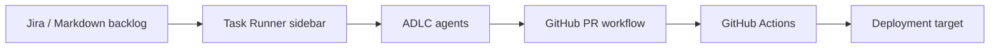

# Tools Workflow Review Notes

These notes describe how local tools, GitHub, GitHub Actions, and deployment
support the ADLC workflow. They are advisory review notes, not the canonical
workflow definition.

Canonical ADLC workflow source:

```text
.agents/documentation/Agentic Workflows/workflow-design/agent-orchestrated-sdlc.mmd
```

## Status

Needs separation of concerns. The previous note was useful as a generic tool
map, but it blurred three different flows:

- full Agent-Orchestrated SDLC;
- Task Runner sidebar convenience actions;
- GitHub Actions CI/CD automation.

## Canonical ADLC Flow

```mermaid
flowchart LR
    Project["Project Description"]
    Product["Product Agent"]
    BA["BA Agent"]
    Architect["Architect Agent"]
    UX["UX Agent"]
    Planner["Project Planner Agent"]
    Backlog["Backlog"]
    Developer["Developer Agent"]
    Spec["Spec Validation Agent"]
    Test["Test Agent"]
    Docs["Documentation Agent"]
    Review["Code Review Agent"]
    Deploy["Deployment Agent"]
    Live["Live Release"]

    Project --> Product --> BA --> Architect --> UX --> Planner --> Backlog
    Backlog --> Developer --> Spec --> Test --> Docs --> Review --> Deploy --> Live
```



`sdlc-orchestrator` is the only agent that enforces the full sequence. Direct
agent invocation remains valid for bounded specialist work, but it does not
prove the complete ADLC workflow has run.

## Supporting Toolchain



## Tool Responsibilities

| Area | Tool | Role | Important boundary |
|---|---|---|---|
| Orchestration | `sdlc-orchestrator` | Sequences ADLC agents and gates | Canonical workflow owner. |
| Planning | Jira / Markdown backlog | Stores prioritized work | Planner owns sequencing. |
| Local actions | Task Runner sidebar | Runs build, test, branch, PR, release helpers | Convenience UI, not proof of ADLC completion. |
| Repository | GitHub | Branches, PRs, review, merge | Code Review Agent owns workflow review gate. |
| Automation | GitHub Actions | CI/CD checks and release automation | Must be deterministic and enforced server-side. |
| Release | Deployment Agent | Release config, approvals, rollback evidence | Production approval is mandatory. |

## Current GitHub Actions Reality

Current workflow files are:

| File | Trigger | Current behavior |
|---|---|---|
| `.github/workflows/ci.yml` | Push/PR to `main` | Runs `npm ci`, `npm run lint`, `npm run build`, and `npm test`, but each step is allowed to echo and continue on failure or missing script. |
| `.github/workflows/cd.yml` | `v*` tags | Placeholder QA deployment echo. |

This means the toolchain map should not claim strong CI/CD enforcement yet.

## Inconsistencies Found

- Prior note said "Claude + Coding"; this repository now documents portable
  agent usage across multiple harnesses.
- Prior deployment section assumed DockerHub and QA/UAT/Prod promotion. Current
  workflow files do not implement that.
- Prior flow started from backlog item only. The canonical ADLC flow starts from
  Project Description and reaches backlog through product, BA, architecture, UX,
  and planning gates.

## Proposed Improvements

- Convert `ci.yml` from "best effort" commands to hard-failing checks once the
  desired CI contract is approved.
- Replace the placeholder `cd.yml` with Deployment Agent-aligned release
  evidence, environment approval, rollback, and smoke-test behavior.
- Add a short UI note explaining that Task Runner actions support, but do not
  replace, `sdlc-orchestrator`.
