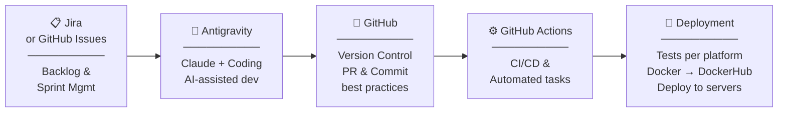
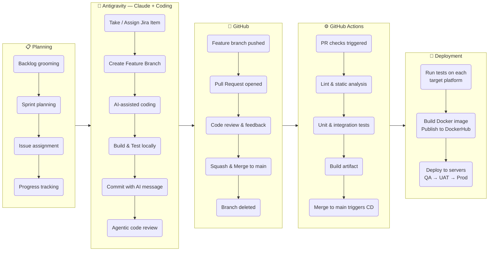
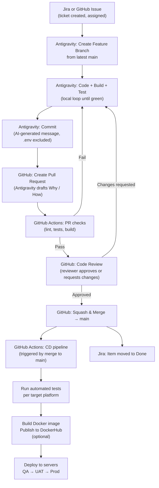
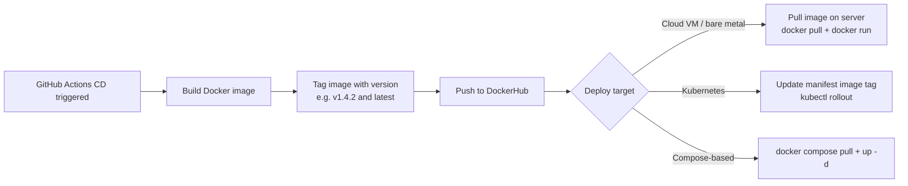
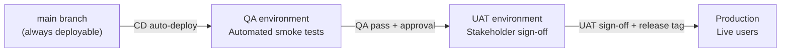

# Tools Workflow

The full pipeline from backlog item to production deployment.

---

## Pipeline Overview



---

## Expanded Stage View



---

## Tool Responsibilities

| Stage | Tool | Role | Key outputs |
|-------|------|------|-------------|
| **Planning** | Jira / GitHub Issues | Backlog management, sprint planning, issue tracking, progress visibility | Prioritized issue with assignee and status |
| **Development** | Antigravity + Claude | AI-assisted coding, branch creation, local build/test, commit message generation, agentic code review | Committed feature branch with passing local tests |
| **Version Control** | GitHub | Source of truth for all code, PR workflow, code review, squash-and-merge to `main` | Clean `main` history with reviewed, approved changes |
| **CI/CD** | GitHub Actions | Automated lint, test, build on every PR and push; triggers deployment pipeline on merge to `main` | Green build artifacts, deployment triggers |
| **Deployment** | GitHub Actions + Docker + Servers | Cross-platform test runs, Docker image build and publish to DockerHub, server deployment across environments | Running application in QA / UAT / Prod |

---

## How the Stages Connect



---

## Docker Path (Optional)

Docker is used when the application is packaged and distributed as a container image.



---

## Environment Promotion



> **Task Runner role at each gate:**
> - Before QA: **Pull Remote and Merge** → **Run Project Tests** → **Create Pull Request**
> - Before UAT: **Increment Version** after QA approval
> - Before Prod: **Create Repo Release** to produce the release tag that triggers the production deployment

---

## Tools at a Glance

```
┌─────────────────┐    ┌──────────────────────┐    ┌────────────────────┐
│  Jira /         │    │    Antigravity        │    │      GitHub        │
│  GitHub Issues  │───▶│  (Task Runner +       │───▶│  (Version control, │
│                 │    │   Claude Code)        │    │   PR workflow,     │
│  • Backlog      │    │                       │    │   code review)     │
│  • Sprints      │    │  • Branch creation    │    │                    │
│  • Assignments  │    │  • AI-assisted coding │    │  • Feature branch  │
│  • Progress     │    │  • Build & test loop  │    │  • Pull Request    │
│                 │    │  • Commit & PR        │    │  • Squash & Merge  │
└─────────────────┘    │  • Code review        │    └────────┬───────────┘
                       └──────────────────────┘             │
                                                             ▼
                       ┌──────────────────────────────────────────────────┐
                       │              GitHub Actions                       │
                       │  (CI/CD — triggers on PR open and merge to main) │
                       │                                                   │
                       │  PR checks: lint · tests · build                 │
                       │  CD pipeline: test matrix · Docker · deploy      │
                       └──────────────────────┬───────────────────────────┘
                                              │
                                              ▼
                       ┌──────────────────────────────────────────────────┐
                       │               Deployment                          │
                       │                                                   │
                       │  • Automated tests per target platform           │
                       │  • Docker image built & pushed to DockerHub      │
                       │  • Servers updated: QA → UAT → Production        │
                       └──────────────────────────────────────────────────┘
```
