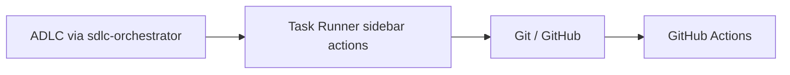
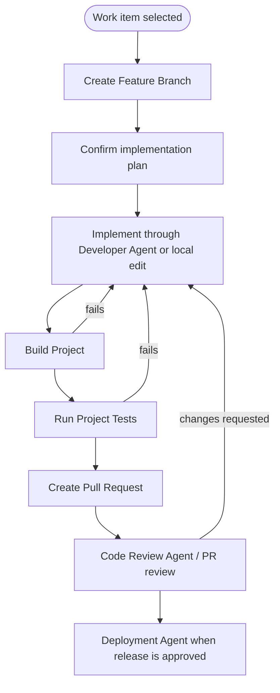

# Task Runner Workflow Review Notes

These notes review the Task Runner sidebar flow and how it should be interpreted
relative to the Agent-Orchestrated SDLC.

## Status

Useful, but it must be framed as a local developer workflow. It is not the full
ADLC workflow. The full workflow is enforced only by `sdlc-orchestrator`.

## Correct Relationship to ADLC



Task Runner actions help execute local repository tasks. They do not replace the
workflow gates:

```text
Project Description -> Product -> BA -> Architect -> UX -> Planner -> Backlog
-> Developer -> Spec Validation -> Test -> Documentation -> Code Review
-> Deployment -> Live
```

## Sidebar Actions That Remain Valid

| Action | Role | ADLC interpretation |
|---|---|---|
| `Build Project` | Runs configured build command | Local developer feedback. |
| `Run Project Tests` | Runs configured test command | Local test feedback; Test Agent still owns workflow verification. |
| `Create Feature Branch` | Creates a task branch | Supports Developer Agent finalization. |
| `Create Pull Request` | Opens PR workflow | Supports Code Review Agent handoff. |
| `Approve a Pull Request` | Runs approval workflow | Supports the review/merge path; does not replace required review evidence. |
| `Create Repo Release` | Runs release automation | Supports Deployment Agent release path. |
| `Autocommit Start/Stop` | Local checkpointing | Convenience only; not an ADLC gate. |

## Recommended Developer Loop



## Inconsistencies Found

- Prior note presented manual sidebar flow as the main workflow, which conflicts
  with the current `Project Description`-first ADLC design.
- Prior note skipped Spec Validation Agent, Test Agent, Documentation Agent, and
  Deployment Agent as explicit workflow gates.
- Prior setup language emphasized `Create CLAUDE.md`; this repository also has
  `Create AGENTS.md` and supports multiple harnesses.
- Prior hotfix path implied release after local approval only. Production still
  requires the mandatory release approval gate.

## Proposed Improvements

- Add a Task Runner UI hint: "For full ADLC orchestration, start with
  `sdlc-orchestrator`; use sidebar actions for local support tasks."
- Add a distinct "direct agent invocation" example for bounded work that is not
  intended to run the full workflow.
- Clarify which actions are local-only convenience actions versus workflow gates.
