# Task Runner — Developer Workflow Reference

A visual map of how a developer uses the Task Runner sidebar to follow best practices from first commit through production release. Each sidebar action is highlighted in **bold** the first time it appears.

---

## Overview: The Full Development Cycle

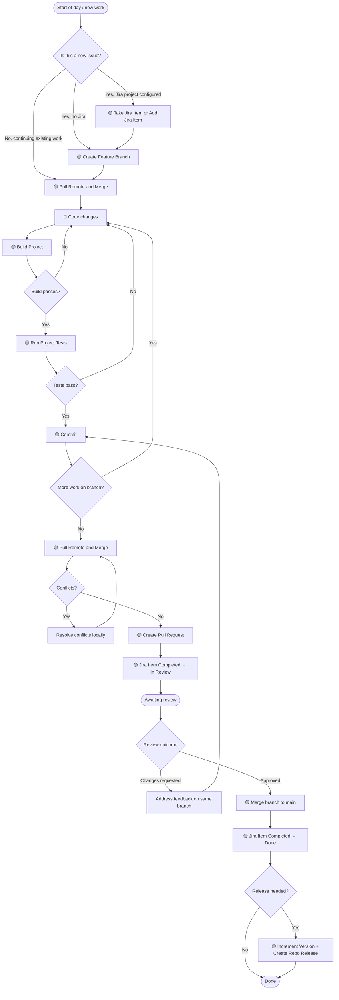

---

## Phase 1: Project Setup (first time only)

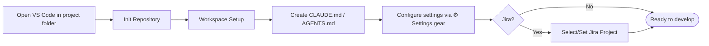

**Sidebar actions used:**

| Step | Sidebar Item | Purpose |
|------|-------------|---------|
| 1 | **Init Repository** | Creates `.git`, sets up remote |
| 2 | **Workspace Setup** | Scaffolds `.agent/` folder structure |
| 3 | **Create CLAUDE.md** | Adds project-level AI guidance file |
| 4 | ⚙️ Settings (gear icon) | Set build command, test command, default reviewer |
| 5 | **Select/Set Jira Project** | Links repo to a Jira project key |

---

## Phase 2: Starting a Work Item

### 2A — Standard feature or fix (no Jira)

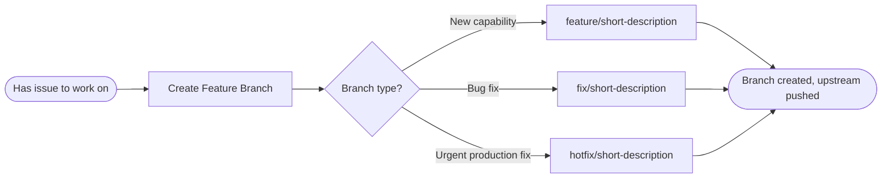

### 2B — Jira-driven work (yourself)

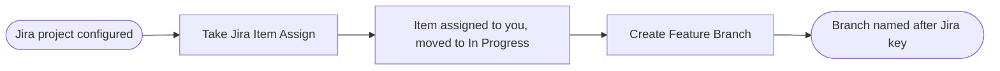

### 2C — Agent-driven work

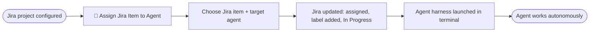

> **When to use each:**
> - Use **2A** when you are coding the feature yourself with no Jira tracking.
> - Use **2B** when you are coding yourself and want Jira kept up to date.
> - Use **2C** to hand off a ticket entirely to an AI agent.

---

## Phase 3: The Development Loop

This loop repeats until the branch is ready for review.

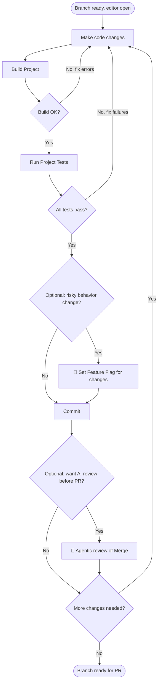

**Sidebar actions used:**

| Step | Sidebar Item | What it does |
|------|-------------|--------------|
| Build | **Build Project** | Runs `antigravity.buildCommand` |
| Test | **Run Project Tests** | Runs `antigravity.projectTestingCommand` |
| Commit | **Commit** | Stages changes, generates AI commit message (via Light Harness), creates commit |
| Feature flag | 🧠 **Set Feature Flag for changes** | Wraps new behavior in `.env`-driven flags |
| AI review | 🧠 **Agentic review of Merge** | Opens harness-driven review focused on merge diff |

> **Commit note:** The **Commit** action excludes `.env` / `config/.env` automatically. It uses the **Light Agentic Harness** (fast/cheap model) for message generation when `antigravity.useAgentForGithubRepositoryManagement` is enabled.

---

## Phase 4: Preparing and Opening the PR

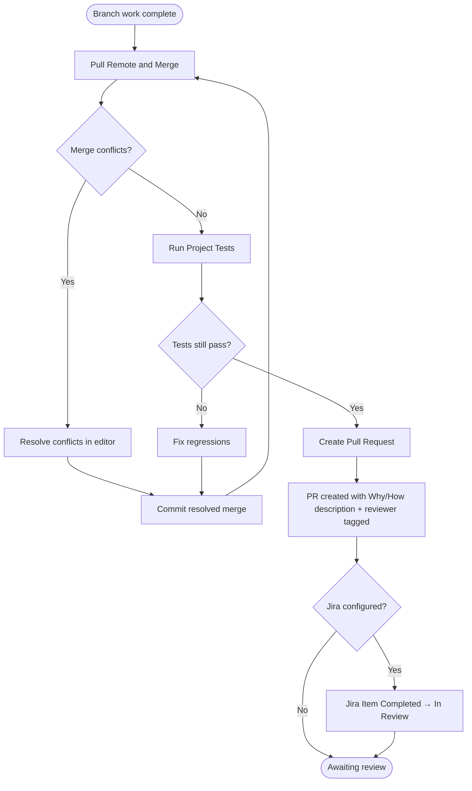

**Sidebar actions used:**

| Step | Sidebar Item | What it does |
|------|-------------|--------------|
| Sync | **Pull Remote and Merge** | Fetches latest `main`, merges into branch, runs tests, pushes |
| PR | 🤖 **Create Pull Request** | AI-assisted: generates Why/How summary, tags reviewer, calls `gh pr create` |
| Jira | **Jira Item Completed** | Moves Jira item to `In Review` |

> **PR rule:** Always run **Pull Remote and Merge** before **Create Pull Request**. The PR should land without conflicts.

---

## Phase 5: Code Review (as Reviewer)

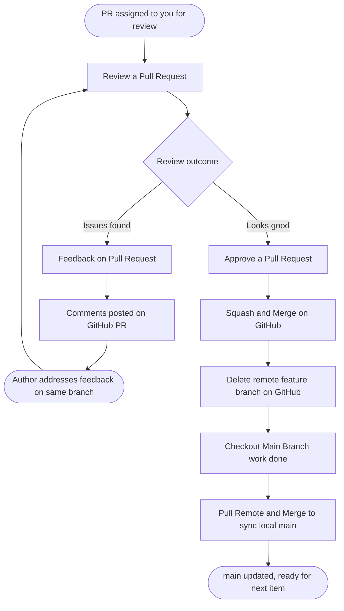

**Sidebar actions used:**

| Step | Sidebar Item | What it does |
|------|-------------|--------------|
| Review | **Review a Pull Request** | Opens agentic review terminal for the PR |
| Feedback | **Feedback on Pull Request** | Posts structured review feedback to the PR |
| Approve | **Approve a Pull Request** | Runs the approval and merge flow |
| Cleanup | **Checkout Main (Branch work done)** | Switches local back to `main` after merge |

---

## Phase 6: Versioning and Release

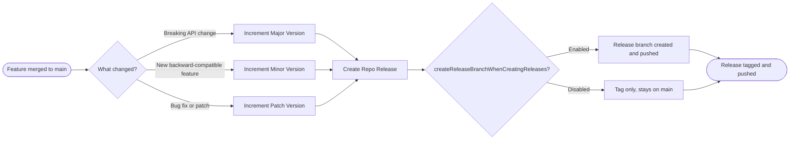

**Sidebar actions used:**

| Step | Sidebar Item | What it does |
|------|-------------|--------------|
| Semver bump | **Increment Major / Minor / Patch Version** | Runs version bump script |
| Release | **Create Repo Release** | Tags commit, optionally creates a release branch |

---

## Phase 7: Hotfix (Urgent Production Fix)

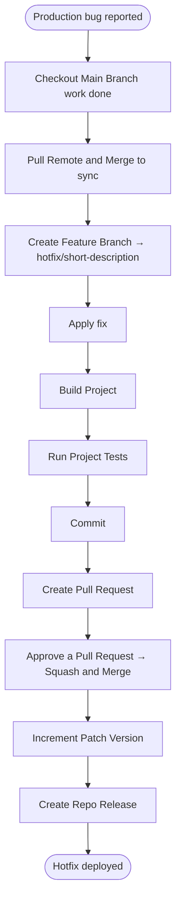

> Hotfixes follow the same PR flow as normal features — there are no special branches in GitHub Flow. The `hotfix/` prefix is just a naming convention.

---

## Phase 8: Autocommit Mode (Long Running Work)

Autocommit creates periodic background commits while you work, so you never lose progress.

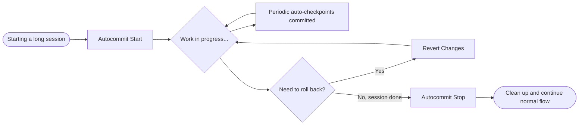

**Sidebar actions used:**

| Step | Sidebar Item | What it does |
|------|-------------|--------------|
| Start | **Autocommit Start** | Begins background periodic commit loop |
| Rollback | **Revert Changes** | Reverts the current autocommit changeset |
| Stop | **Autocommit Stop** | Stops the background loop |

---

## Common Sidebar Actions — Quick Reference

| Emoji | Meaning |
|-------|---------|
| 🤖 | Agent-assisted (uses an AI harness) |
| 🧠 | Fully agentic (opens AI agent terminal) |
| 🟡 | Manual (no AI involved) |

| Sidebar Item | Phase | AI? | Key precondition |
|---|---|---|---|
| Init Repository | Setup | — | No `.git` folder |
| Workspace Setup | Setup | — | Any time |
| Create Feature Branch | Start work | — | Repo is a Git repo |
| Take Jira Item (Assign) | Start work | — | Jira configured |
| 🧠 Assign Jira Item to Agent | Start work | Full agent | Jira configured |
| Build Project | Dev loop | — | Build command set |
| Run Project Tests | Dev loop | — | Test command set |
| 🤖 Commit | Dev loop | Light harness | Git repo, `useAgentForGithubRepositoryManagement` on |
| 🧠 Set Feature Flag for changes | Dev loop | Full agent | Any time |
| 🧠 Agentic review of Merge | Dev loop | Full agent | Clean working tree |
| Pull Remote and Merge | Pre-PR / daily sync | — | Not on `main` |
| 🤖 Create Pull Request | PR | Agent (AI Why/How) | Git repo, synced with `main` |
| Review a Pull Request | Review | — | Open PR exists |
| Feedback on Pull Request | Review | — | Open PR exists |
| Approve a Pull Request | Review | — | PR approved |
| Jira Item Completed | Jira update | — | Jira configured |
| Merge branch to main | Post-review | — | Not on `main` |
| Checkout Main (Branch work done) | Post-merge | — | Git repo |
| Increment Major/Minor/Patch | Release | — | Any time |
| Create Repo Release | Release | — | Git repo with remote |
| Autocommit Start/Stop | Long sessions | Light harness | GitHub remote set |

---

## Daily Developer Checklist

Use this as a mental checklist for a typical day:

```
Morning
  ☐ Pull Remote and Merge (sync your branch with latest main)

Starting new work
  ☐ Take Jira Item (Assign) — if using Jira
  ☐ Create Feature Branch — feature/, fix/, or hotfix/

Per coding session
  ☐ Build Project — verify nothing is broken
  ☐ Run Project Tests — keep the suite green
  ☐ Commit — checkpoint with AI-generated message

Ready for PR
  ☐ Pull Remote and Merge — sync one more time
  ☐ Run Project Tests — confirm still green after sync
  ☐ Create Pull Request — AI drafts the Why/How
  ☐ Jira Item Completed → In Review

After PR is approved
  ☐ Approve a Pull Request + Squash and Merge
  ☐ Checkout Main (Branch work done)
  ☐ Pull Remote and Merge (sync local main)
  ☐ Jira Item Completed → Done
  ☐ Increment Version + Create Repo Release (if applicable)
```
